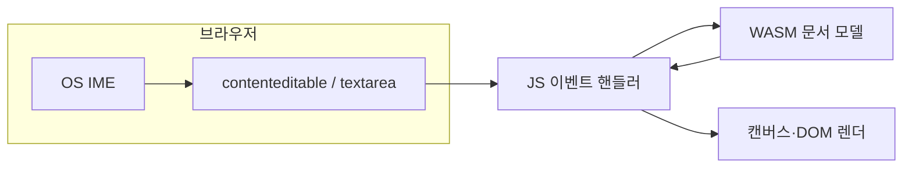

편집기 **문서 모델·렌더링**을 Rust 등 **네이티브 코드나 WebAssembly**로 두는 구현이 있다. IME(조합 입력)는 **그 언어 런타임이 발명한 개념이 아니라**, **OS·브라우저**가 키 입력을 조합 문자열로 바꾼 뒤 **앱에 넘기는 쪽**에서 끝난다. 이 문서는 **웹·웹뷰**를 전제로, 네이티브/WASM 코어와 **IME가 맞닿는 경계**를 정리한다.

---

## 1. 책임 분리

| 층 | 역할 |
|----|------|
| **OS / 브라우저** | 물리 키·소프트 키보드 입력을 **조합 중(preedit)·확정(commit)** 문자열로 만든다. 후보 창 위치·TSF/NSTextInputClient 등은 여기서 처리된다. |
| **JS·뷰(입력 표면)** | `contenteditable`·`textarea`·**EditContext** 등에 붙은 **CompositionEvent**·**InputEvent**를 구독하고, 문서 모델로 넘길 **데이터**를 뽑는다. |
| **Rust / WASM 문서 모델** | **삽입·삭제** 등 확정 연산을 적용한다. 조합 **세션**을 모르게 두고 **델타만** 받도록 설계하는 경우가 많다. |

Rust나 WASM이 **직접** OS IME API를 부르는 구조는 **일반적인 웹 에디터**에서는 드물다. 대부분 **브라우저가 composition을 처리**하고, 앱은 DOM 이벤트 또는 EditContext 콜백만 받는다.

**EditContext는 필수가 아니다.** `contenteditable` 또는 `textarea`로 포커스를 받으면 브라우저가 IME·문자 경계를 처리하므로, **숨은 DOM 입력**만으로도 WASM과 연결할 수 있다(아래 §2.2).

---

## 2. 브라우저에서 입력 표면을 두는 방식

### 2.1 DOM 없이 캔버스만 쓰는 경우

- 브라우저가 **문자 경계**를 모르면 IME 후보 창 위치가 틀어질 수 있다. **EditContext API**로 `characterboundsupdate`에 응답하고 **updateCharacterBounds()**로 좌표를 넘긴다. 상세는 [IME 구현 상세 §3 웹: EditContext API](/docs/reference/ime-implementation-details) 참고.
- 지원 브라우저·실험 플래그는 시점마다 다르므로 [MDN EditContext](https://developer.mozilla.org/en-US/docs/Web/API/EditContext)를 본다.

### 2.2 DOM 기반: `contenteditable` · `textarea`

- **포커스가 있는 DOM**이 있으면 IME는 그 요소를 통해 들어온다. 실제 글자는 **캔버스/WebGPU로만** 그리고, 입력은 **화면 밖·투명한 `contenteditable`**에 두는 방식이 흔하다. [에디터 IME 구현 가이드](/docs/editor/implementation-notes)의 **composition·input** 규칙이 그대로 적용된다.
- **동기화**: DOM에 보이는 텍스트와 WASM 문서 모델이 **어긋나면** 커서·조합 표시가 깨진다. **어느 쪽을 편집 중인 진실 원천(source of truth)**으로 둘지 정해야 한다(§3).

---

## 3. `contenteditable`과 WASM 연결

입력은 DOM이 받고, **저장·렌더링 로직**은 WASM에 두는 구조다. **JavaScript**가 이벤트를 구독하고 WASM **export**를 호출해 모델을 갱신한다.

### 3.1 JS에서 하는 일

1. **`contenteditable`(또는 `textarea`)에 리스너**를 단다: `compositionstart` · `compositionupdate` · `compositionend` · `beforeinput` · `input`.
2. **확정된 변경**만 WASM에 넘긴다. 보통은 `compositionend`의 `data`, 또는 `composition` 없이 오는 `input`의 `insertText`([composition 시나리오](/docs/reference/composition-edge-cases)).
3. **삭제·교체**는 `beforeinput`의 `inputType`·`getTargetRanges()`([inputType 상세](/docs/reference/inputtype))로 범위를 잡거나, `input`에서 직전 DOM과의 차이로 델타를 만든다.
4. **커서·선택**은 `document.getSelection()` / `Selection` API로 **논리 오프셋**을 구한 뒤 WASM에 넘긴다. JS 문자열은 **UTF-16 코드 유닛**, Rust `String`은 **UTF-8**이므로 오프셋 규칙을 한쪽으로 통일한다([유니코드 기본](/docs/reference/unicode-basics)).

**바인딩**: Rust는 `wasm-bindgen` 등으로 `pub fn apply_insert(offset: usize, text: String)` 같은 **export**를 노출하고, JS에서 `import`한 모듈의 함수를 호출한다.

### 3.2 패턴 A: 조합이 끝난 뒤에만 WASM 반영

- **조합 중**: preedit은 **브라우저가 DOM에 그린다**. WASM 문서 모델에는 **아직 넣지 않거나**, “로컬 조합 구간”만 별도 플래그로 둔다.
- **`compositionend`**(또는 그에 상응하는 **commit** 확정)에서만 `apply_insert` / `apply_delete` 등을 호출한다.
- [글자 조합 개념](/docs/guide/composition-concepts)과 맞고, 구현·디버깅이 단순하다.

### 3.3 패턴 B: `input`마다 DOM과 WASM 동기화

- 매 `input` 이벤트마다 `innerText`·`textContent` 전체를 읽어 WASM에 **전체 문서를 덮어쓰기**하거나, `beforeinput`으로 **변경 구간**만 넘긴다.
- 조합 중 **매 틱** 동기화는 이벤트 순서·중복([브라우저·플랫폼별 IME 동작 차이](/docs/reference/browser-platform-quirks))에 취약하다. **패턴 A**를 권장하는 편이 많다.

### 3.4 렌더링과 DOM의 역할

| 방식 | 설명 |
|------|------|
| **편집면이 곧 DOM** | 사용자가 보는 `contenteditable`이 본문이다. WASM은 **인덱스·검색** 등에만 쓰고, 표시는 DOM이 담당한다. 동기화는 **한 방향**을 명확히 한다. |
| **숨은 입력 + 캔버스** | 포커스는 숨은 `contenteditable`에 두고, 화면은 WASM이 계산한 레이아웃으로 **캔버스에만** 그린다. DOM 문자열과 WASM 버퍼가 **항상 같아야** 하므로, commit 시점에 **DOM을 비우거나** WASM 상태를 복사해 맞추는 규칙이 필요하다. |

### 3.5 주의: 이중 반영·붙여넣기

- **이중 반영**: DOM에 글자가 들어간 뒤 WASM에도 넣고, 다시 DOM을 WASM 기준으로 **통째로 덮어쓰면** 조합 중 깨짐·중복이 난다. **“commit 전에는 DOM만 / commit 후에 WASM만 갱신”**처럼 **단계**를 나눈다.
- **붙여넣기**: `contenteditable`은 HTML이 들어올 수 있다. 평문만 WASM으로 넣으려면 `beforeinput`에서 가로채거나, 붙여넣기 시 **plain text**만 삽입하도록 처리한다.

---

## 4. WASM·JS 경계에서 깨지기 쉬운 점

- **이벤트 순서**: `compositionupdate` 여러 번 → `compositionend` → 직후 `input` 등 **명세와 다른 순서**가 나올 수 있다([브라우저·플랫폼별 IME 동작 차이](/docs/reference/browser-platform-quirks)). JS에서 한 번 정리한 뒤 WASM으로 넘기면 **순서가 뒤바뀌지 않게** 큐를 둔다.
- **비동기**: `requestAnimationFrame`·다음 틱에만 코어를 갱신하면, 그 사이 **composition 이벤트**가 여러 번 올 수 있다. 조합 중 상태는 **JS 쪽**에서 유지하고, 코어에는 **commit 단위**만 보내는 편이 단순하다.
- **문자 단위**: Rust `String`은 UTF-8, JS 문자열은 UTF-16 코드 유닛이다. **오프셋**을 넘길 때 [유니코드 기본](/docs/reference/unicode-basics)의 서로게이트·코드 포인트와 맞출 것.
- **누락**: WASM 호출 비용 때문에 이벤트를 **샘플링**하면 조합이 깨진다. composition 관련 이벤트는 **건너뛰지 않는다**.

---

## 5. Tauri·Electron·모바일 웹뷰

- **웹뷰** 안에서 돌리면 결국 **Chromium/WebKit의 composition** 규칙을 따른다. 네이티브 셸이 Rust여도 IME 경로는 [다른 플랫폼 IME](/docs/reference/ime-other-platforms)와 같은 범주다.
- **데스크톱 네이티브 UI**(GTK/Qt 등)만 쓰는 에디터는 웹 명세가 아니라 툴킷의 **입력 모듈** 문서를 봐야 한다. 이 사이트의 **CompositionEvent** 설명은 **웹 DOM** 기준이다.

---

## 6. 협업(OT/CRDT)과 조합

- 원격 편집과 동시에 로컬에서 IME 조합이 진행되면 **같은 구간**에 대한 갱신이 겹칠 수 있다. **조합이 끝난 문자열**만 CRDT/OT에 넣고, preedit은 **로컬 전용 표시**로 두는 방식이 흔하다.
- 구체 알고리즘은 에디터 제품마다 다르다. 여기서는 **“조합 중 문서에 커밋하지 않는다”**는 원칙만 맞추면 IME 측 요구는 충족하기 쉽다([글자 조합 개념](/docs/guide/composition-concepts)).

---

## 7. 참고

- [에디터 IME 구현 가이드](/docs/editor/implementation-notes) — composition·input 처리
- [IME 구현 상세](/docs/reference/ime-implementation-details) — EditContext, TSF, NSTextInputClient
- [composition 시나리오별 처리 규칙](/docs/reference/composition-edge-cases)
- [텍스트 세그멘테이션](/docs/reference/text-segmentation) — 서로게이트·그래핀, 커서 단위
