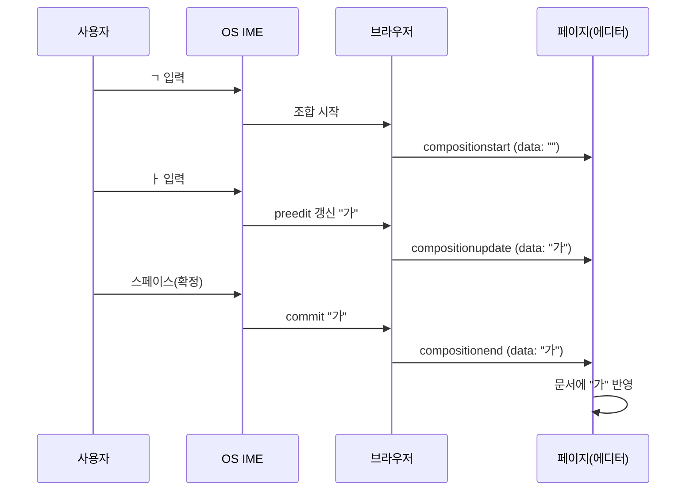

웹에서 IME 조합은 **CompositionEvent**와 **InputEvent**로 전달된다. W3C UI Events 명세와 Input Events Level 2에서 정의한다.

## composition 이벤트 흐름 (한 번의 조합)

한글 "가"를 입력할 때(ㄱ → ㅏ → 스페이스) 이벤트가 흐르는 순서는 아래와 같다. 브라우저·IME에 따라 `compositionupdate` 횟수는 다를 수 있다.

## composition 이벤트

| 이벤트 | 발생 시점 | `CompositionEvent.data` |
|--------|-----------|-------------------------|
| **compositionstart** | 조합 세션이 시작될 때(예: 한글 IME에서 첫 자모 입력). | 조합으로 대체될 기존 선택 영역의 문자열. 없으면 빈 문자열. |
| **compositionupdate** | 조합 중 문자열이 바뀔 때(자모 추가·삭제 등). | 현재 조합 중인 문자열. |
| **compositionend** | 조합이 끝날 때(commit 또는 취소). | commit이면 확정된 최종 문자열; 취소면 빈 문자열. |

`CompositionEvent`는 사용자가 IME를 통해 **간접적으로** 텍스트를 입력할 때 발생한다(MDN). `data`는 이벤트 종류에 따라 위와 같이 달라진다.

## beforeinput / input과의 관계

- **beforeinput**  
  `<input>`, `<textarea>`, 또는 `contenteditable`/`designMode`인 요소의 값이 바뀌기 **직전**에 발생한다. `InputEvent.inputType`으로 변경 종류를 구분할 수 있다.

- **IME 조합 관련 inputType**  
  Input Events Level 2에는 조합 시작·조합 텍스트 삽입·조합 종료를 구분하는 inputType이 있다. 예: `insertCompositionText`는 IME 조합으로 텍스트가 삽입되는 경우에 대응한다. 조합 중에는 `insertCompositionText` 등 조합 관련 타입이 오고, 일반 영문 입력은 `insertText` 등으로 온다.

- **발생 순서**  
  조합 시작 시: `compositionstart` → (필요 시) `beforeinput` → `compositionupdate`.  
  조합 중 변경: `compositionupdate` (및 필요 시 `beforeinput`).  
  조합 종료(commit): `compositionend` → (필요 시) `beforeinput` → `input`.  
  브라우저마다 세부 순서나 조합 시 `input` 발생 여부가 다를 수 있으므로, 실제 타겟 브라우저에서 한 번씩 로그로 확인하는 것이 좋다.

## 조합 중 선택 영역·커서

조합이 진행되는 동안 `getSelection()` 또는 `selectionStart`/`selectionEnd`로 얻는 범위는 **조합 중인 구간 전체**를 가리키는 경우가 많다. 즉, 조합 문자열이 한 덩어리로 선택된 것처럼 보이거나, 커서가 그 끝에 있다. 에디터는 이 구간을 하나의 “composition 노드” 또는 “preedit 구간”으로 취급하고, 조합이 끝날 때까지 이 구간을 통째로 교체하는 방식이 안전하다.

## 취소와 commit

- **취소**  
  사용자가 Esc를 누르거나, 다른 요소로 포커스를 옮기면 조합이 취소된다. `compositionend`가 발생하고, 이때 `data`는 **빈 문자열**이다. 에디터는 이 구간의 조합 중 문자열을 제거하면 된다.

- **commit**  
  스페이스·엔터로 음절을 확정하거나, 다음 자모 입력으로 이전 글자가 확정되는 경우 `compositionend`가 발생하고, `data`에 **확정된 최종 문자열**이 들어 있다. 이 문자열을 문서에 반영하고, 조합 구간을 이 문자열로 교체하면 된다.

한글의 경우 “ㄱ” → “가” → 스페이스 순으로 입력하면, 마지막에 `compositionend`가 한 번 발생하고 `data`에 “가”가 온다. 브라우저·OS에 따라 `compositionupdate` 호출 횟수나 `data` 내용이 조금 다를 수 있다.
