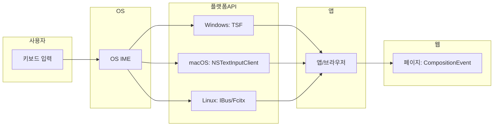

IME는 **키 이벤트 → OS/플랫폼 IME → 앱** 순으로 이어지는 계층에서 동작한다. 입력 컨텍스트(Input Context)는 “지금 포커스가 있는 입력 대상”에 붙은 IME 상태를 가리키며, OS·플랫폼이 소유하고 앱은 그 결과(조합 중 문자열, commit)만 받는다.

## 구조 (플랫폼별)

앱은 **preedit**(조합 중 문자열)과 **commit**(확정 문자열)만 받고, 키 코드는 직접 다루지 않는다.

## 전체 흐름

1. 사용자가 키를 누르면 **키보드 드라이버**가 OS에 키 이벤트를 전달한다.
2. **OS/플랫폼 IME**가 그 이벤트를 받아 조합한다. 한글·일본어·중국어 등은 키 시퀀스를 자모·문절 등으로 바꾼다.
3. 조합 중이면 **preedit(조합 중 문자열)**을, 확정되면 **commit(최종 문자열)**을 **앱**에 넘긴다.
4. 앱(브라우저, 에디터)은 preedit을 임시로 표시하고, commit을 문서에 반영한다.

앱은 “어떤 키가 눌렸는지”보다 “지금 조합 중인 문자열”과 “지금 확정된 문자열”에만 반응하면 된다. 키 매핑과 조합 알고리즘은 IME 쪽에 있다.

## 플랫폼별 차이

| 플랫폼 | IME 연동 방식 | 비고 |
|--------|----------------|------|
| **Windows** | TSF(Text Services Framework), 구형 IMM32 | TSF가 현행 방식. 앱은 TSF API로 조합 문자열·commit을 받는다. |
| **macOS** | Input Method Kit, Cocoa NSTextInputClient | 앱이 NSTextInputClient 프로토콜을 구현하면 IME가 조합 문자열·commit을 전달한다. |
| **Linux** | XIM(X Input Method), IBus, Fcitx | XIM은 레거시. IBus·Fcitx가 널리 쓰이며, 한글은 libhangul 기반 엔진(ibus-hangul, fcitx-hangul)을 쓴다. |
| **웹** | 브라우저가 OS IME와 연동 | 브라우저가 OS IME 결과를 받아 `CompositionEvent`·`InputEvent`로 페이지에 전달한다. |

각 플랫폼에서 “조합 중 문자열”이 앱에 전달되는 프로토콜·API 이름은 다르지만, 결과적으로 “preedit”과 “commit” 두 종류의 문자열이 앱에 온다는 점은 같다.

## 웹/브라우저

웹 페이지는 OS IME를 직접 호출하지 않는다. **브라우저**가 OS IME와 연동하고, 그 결과를 DOM 이벤트로 넘긴다.

- **compositionstart** / **compositionupdate** / **compositionend**: 조합 시작·변경·종료. `CompositionEvent.data`에 조합 중 문자열 또는 commit 문자열이 들어 있다.
- **beforeinput** / **input**: 값 변경 직전·직후. `inputType`이 `insertCompositionText` 등이면 조합 관련 입력이다.

이벤트 순서나 조합 중 `input` 발생 여부는 브라우저마다 다를 수 있다. Chrome, Firefox, Safari, Edge에서 한글·일본어 입력을 넣어 보며 로그로 확인하는 것이 좋다.

## 입력 컨텍스트와 포커스

입력 컨텍스트는 **포커스가 있는 요소**에 붙는다. 포커스가 다른 입력 가능 요소로 이동하면:

- 현재 조합은 **취소**되는 경우가 많고, `compositionend`가 발생하며 `data`가 빈 문자열로 온다.
- 플랫폼·브라우저에 따라 “조합을 유지한 채 포커스만 이동”하는 경우도 있으나, 에디터는 “포커스 이동 시 조합 취소”를 가정하고 처리해도 된다.

포커스가 없으면 IME 조합 결과를 받을 입력 대상이 없으므로, 포커스 관리가 IME 동작의 전제가 된다.
