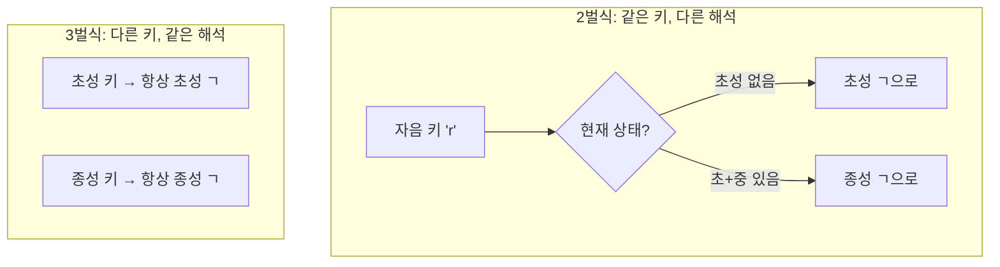
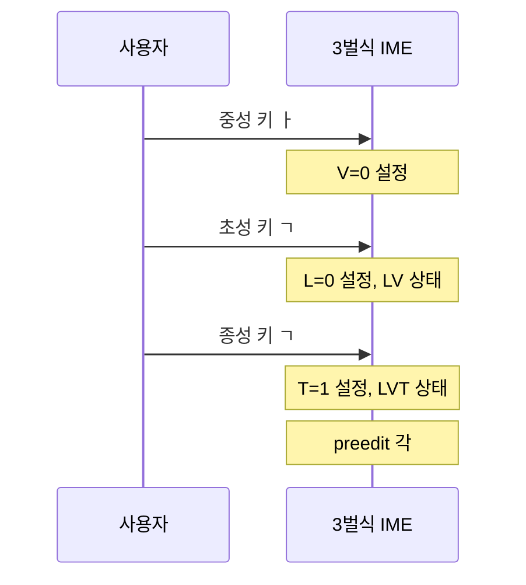

**3벌식**은 한글 자모를 **세 벌**(초성 벌·중성 벌·종성 벌)로 나누어 **서로 다른 글쇠**에 배치하는 방식이다. 2벌식과 달리 **같은 키**가 **초성**이 될 때와 **종성**이 될 때 **물리적으로 다른 키**이므로, **상태에 따른 키 해석**이 필요 없고, **키 → 자모(벌별)** 매핑만 하면 된다.

---

## 0. 2벌식 vs 3벌식 키 처리 비교



**핵심 차이:**
- **2벌식**: "이 키가 초성인가 종성인가?"를 **상태**로 판단
- **3벌식**: "이 키는 어떤 **벌**인가?"로 판단 (상태 불필요)

---

## 1. 키 → 유니코드 매핑 (3벌식)

### 1.1 유니코드 한글 블록

3벌식도 2벌식과 동일한 유니코드 블록을 사용한다:

| 블록 | 범위 | 용도 |
|------|------|------|
| **Hangul Jamo** | U+1100–U+11FF | 조합용 자모 (초성·중성·종성 구분) |
| **Hangul Compatibility Jamo** | U+3130–U+318F | 호환용 자모 (독립 표기) |
| **Hangul Syllables** | U+AC00–U+D7AF | 완성형 음절 |

### 1.2 공병우 세벌식 키 → 유니코드 매핑 (예시)

**초성 벌** (오른손 영역):

| 영문 키 | 한글 | Jamo (초성) | Compatibility |
|---------|------|-------------|---------------|
| y | ㄱ | U+1100 | U+3131 |
| Y (Shift+y) | ㄲ | U+1101 | U+3132 |
| u | ㄴ | U+1102 | U+3134 |
| i | ㄷ | U+1103 | U+3137 |
| I (Shift+i) | ㄸ | U+1104 | U+3138 |
| o | ㄹ | U+1105 | U+3139 |
| p | ㅁ | U+1106 | U+3141 |
| h | ㅂ | U+1107 | U+3142 |
| H (Shift+h) | ㅃ | U+1108 | U+3143 |
| j | ㅅ | U+1109 | U+3145 |
| J (Shift+j) | ㅆ | U+110A | U+3146 |
| k | ㅇ | U+110B | U+3147 |
| l | ㅈ | U+110C | U+3148 |
| L (Shift+l) | ㅉ | U+110D | U+3149 |
| ; | ㅊ | U+110E | U+314A |
| ' | ㅋ | U+110F | U+314B |
| n | ㅌ | U+1110 | U+314C |
| m | ㅍ | U+1111 | U+314D |
| , | ㅎ | U+1112 | U+314E |

**중성 벌** (가운데 영역):

| 영문 키 | 한글 | Jamo (중성) | Compatibility |
|---------|------|-------------|---------------|
| f | ㅏ | U+1161 | U+314F |
| 6 | ㅐ | U+1162 | U+3150 |
| t | ㅑ | U+1163 | U+3151 |
| 7 | ㅒ | U+1164 | U+3152 |
| r | ㅓ | U+1165 | U+3153 |
| c | ㅔ | U+1166 | U+3154 |
| e | ㅕ | U+1167 | U+3155 |
| 8 | ㅖ | U+1168 | U+3156 |
| d | ㅗ | U+1169 | U+3157 |
| 4 | ㅛ | U+116D | U+315B |
| s | ㅜ | U+116E | U+315C |
| 5 | ㅠ | U+1172 | U+3160 |
| w | ㅡ | U+1173 | U+3161 |
| g | ㅣ | U+1175 | U+3163 |

**종성 벌** (왼손 영역):

| 영문 키 | 한글 | Jamo (종성) | Compatibility |
|---------|------|-------------|---------------|
| x | ㄱ | U+11A8 | U+3131 |
| X (Shift+x) | ㄲ | U+11A9 | U+3132 |
| v | ㄴ | U+11AB | U+3134 |
| / | ㄷ | U+11AE | U+3137 |
| z | ㄹ | U+11AF | U+3139 |
| a | ㅁ | U+11B7 | U+3141 |
| ! | ㅂ | U+11B8 | U+3142 |
| q | ㅅ | U+11BA | U+3145 |
| Q (Shift+q) | ㅆ | U+11BB | U+3146 |
| 1 | ㅇ | U+11BC | U+3147 |
| @ | ㅈ | U+11BD | U+3148 |
| # | ㅊ | U+11BE | U+314A |
| $ | ㅋ | U+11BF | U+314B |
| 3 | ㅌ | U+11C0 | U+314C |
| 2 | ㅍ | U+11C1 | U+314D |
| % | ㅎ | U+11C2 | U+314E |

**참고**: 위 매핑은 공병우 세벌식 390 레이아웃 예시이다. 3-90, 3-91, 3-2015 등 세벌식 배열마다 키 위치가 다르다.

### 1.3 2벌식과 3벌식의 유니코드 차이

| 항목 | 2벌식 | 3벌식 |
|------|-------|-------|
| **초성 ㄱ 입력** | 'r' 키 → U+1100 (상태에 따라) | 초성 벌 'y' 키 → U+1100 (항상) |
| **종성 ㄱ 입력** | 'r' 키 → U+11A8 (상태에 따라) | 종성 벌 'x' 키 → U+11A8 (항상) |
| **유니코드 코드포인트** | 동일 | 동일 |
| **키→자모 결정 방식** | 상태(L/LV/LVT)에 따라 | 키 위치(벌)에 따라 |

최종 유니코드 출력은 동일하지만, **어떤 키**가 **어떤 자모**에 매핑되는지가 다르다.

---

## 2. 2벌식과의 차이

| 항목 | 2벌식 | 3벌식 |
|------|--------|--------|
| **벌 구분** | 자음 벌·모음 벌 두 벌 | 초성 벌·중성 벌·종성 벌 세 벌 |
| **같은 키** | 자음 키 하나가 **초성**이 될 수도 **종성**이 될 수도 있음 | 초성 키·종성 키가 **분리**되어 있음 |
| **상태 의존** | **현재 상태**(초성만 / 초성+중성 / 초성+중성+종성)에 따라 **같은 자음 키**를 초성 또는 종성으로 해석 | **키 위치**만으로 초성/중성/종성 구분. 상태에 따라 키 해석을 바꿀 필요 없음 |
| **조합 알고리즘** | L,V,T 상태 머신 + **키→(L,V,T)** 시 **상태에 따라** 초성/종성 구분 | L,V,T 상태 머신 + **키→(L,V,T)** 시 **벌(키 위치)** 로 초성/중성/종성 구분 |
| **완성형 공식** | 동일: S = 0xAC00 + (L×588) + (V×28) + T | 동일 |

즉, **완성형 계산**과 **L,V,T 상태 전이**(초성→중성→종성 순서)는 2벌식과 같고, **키 입력을 (L,V,T)로 바꾸는 방식**만 다르다. 3벌식에서는 **키가 이미 "초성 키" "중성 키" "종성 키"**로 구분되어 들어오므로, **keyToChoseong(key)** / **keyToJungseong(key)** / **keyToJongseong(key)** 를 **키 위치(벌)** 에 따라 호출하면 된다.

---

## 3. 공병우 세벌식 (개요)

가장 널리 알려진 **공병우 세벌식**은 수동 타자기에서 활자 엉킴을 피하기 위해 설계된 배열이다.

- **초성**: 오른쪽 자리
- **중성(모음)**: 왼쪽 가운데
- **종성(받침)**: 맨 왼쪽

타자기에서는 **초성·중성·종성**을 **서로 다른 벌의 글쇠**로 눌러 한 음절을 만든다. 컴퓨터 3벌식 IME도 **키보드 배열**만 3벌로 나누고, **키 → L / V / T** 매핑 테이블을 벌별로 두면 된다.

---

## 4. 3-2015 자판 (개요)

**3-2015** 자판은 **E/R/D/F/C/V** 위치의 글쇠가 **자동으로 중성인지 종성인지 판단**하도록 설계된 최신 세벌식 배열이다. Shift 없이도 입력할 수 있도록, **키 위치**만으로 벌이 결정된다. 구체적인 키→L/V/T 매핑은 [세벌.org 3-2015](https://sebeol.org/3-2015.html) 등 공개 자료를 참고한다.

---

## 5. 상태 전이 (2벌식과 동일)

3벌식도 **한 음절**은 **초성 → 중성 → (종성)** 순서로만 쌓인다. 따라서 **상태 전이**는 2벌식과 동일하다.

- **초성만** → 중성 키 입력 시 **(L,V)** 로 전이.
- **초성+중성** → 종성 키 입력 시 **(L,V,T)** 로 전이(받침 가능할 때). 모음 키 입력 시 commit + 새 (L,V)(겹모음이 아니면).
- **초성+중성+종성** → 모음 키 입력 시 commit + **종성→초성** 변환으로 새 L, 새 V. 자음 키 입력 시 commit + 새 초성 또는 겹받침(3벌식에서도 겹받침은 규칙이 있음).

**차이점**: 3벌식에서는 **자음 키**가 "초성 키"인지 "종성 키"인지 **키 위치**로 구분되므로, **현재 상태가 "초성+중성"인데 자음 키가 눌렸다**고 해서 "이걸 종성으로 쓸까? 아니면 commit하고 초성으로 쓸까?"를 **키가 종성 벌인지 초성 벌인지**로만 판단하면 된다. 2벌식처럼 "같은 키를 종성으로 해석할지 초성으로 해석할지" 상태로 나누지 않아도 된다.

---

## 6. 겹모음·겹받침 (3벌식)

- **겹모음**: 2벌식과 동일하게 **중성 벌**에서 **두 키 시퀀스**로 겹모음(ㅘ, ㅙ, …)을 입력한다. (V 인덱스 조합 규칙은 [한글 조합 규칙](/korean/combination-rules/)과 동일.)
- **겹받침**: **종성 벌**에서 **두 키 시퀀스**로 겹받침(ㄳ, ㄵ, …)을 입력한다. 3벌식에서는 종성 키가 분리되어 있으므로, "첫 종성 키 + 두 번째 종성 키" → 겹받침 T 로 매핑하면 된다.

---

## 7. 3벌식 구현 (JavaScript)

### 7.1 키 매핑 (공병우 세벌식 예시)

```javascript
// 초성 벌 (오른손)
const KEY_TO_CHOSEONG_3SET = {
  'y': 0,  // ㄱ
  'u': 2,  // ㄴ
  'i': 3,  // ㄷ
  'o': 5,  // ㄹ
  'p': 6,  // ㅁ
  'h': 7,  // ㅂ
  'j': 9,  // ㅅ
  'k': 11, // ㅇ
  'l': 12, // ㅈ
  ';': 14, // ㅊ
  // ...
};

// 중성 벌 (가운데)
const KEY_TO_JUNGSEONG_3SET = {
  'f': 0,  // ㅏ
  'r': 4,  // ㅓ
  'd': 8,  // ㅗ
  's': 13, // ㅜ
  'e': 18, // ㅡ
  'w': 20, // ㅣ
  // ...
};

// 종성 벌 (왼손)
const KEY_TO_JONGSEONG_3SET = {
  'q': 1,  // ㄱ (종성)
  'a': 4,  // ㄴ (종성)
  'z': 7,  // ㄷ (종성)
  '1': 8,  // ㄹ (종성)
  '2': 16, // ㅁ (종성)
  '3': 17, // ㅂ (종성)
  // ...
};
```

### 7.2 process 함수 차이

```javascript
// 2벌식: 상태에 따라 같은 키를 다르게 해석
function process2Set(key) {
  if (key in KEY_TO_CONSONANT) {
    const choseong = KEY_TO_CONSONANT[key];
    
    if (this.state === 'LV') {
      // 같은 키지만 종성으로 해석
      const jongseong = CHOSEONG_TO_JONGSEONG[choseong];
      if (jongseong) this.T = jongseong;
    } else {
      // 초성으로 해석
      this.L = choseong;
    }
  }
}

// 3벌식: 키 위치(벌)가 이미 역할을 결정
function process3Set(key) {
  if (key in KEY_TO_CHOSEONG_3SET) {
    // 초성 벌 키는 항상 초성
    this.L = KEY_TO_CHOSEONG_3SET[key];
  }
  else if (key in KEY_TO_JUNGSEONG_3SET) {
    // 중성 벌 키는 항상 중성
    this.V = KEY_TO_JUNGSEONG_3SET[key];
  }
  else if (key in KEY_TO_JONGSEONG_3SET) {
    // 종성 벌 키는 항상 종성
    this.T = KEY_TO_JONGSEONG_3SET[key];
  }
}
```

### 7.3 입력 순서 유연성

3벌식에서는 **순서가 틀려도** 키가 벌로 구분되어 있어 복구 가능:



**결과**: 순서와 무관하게 "각" 조합 완성

---

## 8. libhangul 사용

**libhangul**은 2벌·3벌 모두 지원한다.

```c
// 2벌식
HangulInputContext* hic2 = hangul_ic_new("2");

// 3벌식 (공병우 390)
HangulInputContext* hic3 = hangul_ic_new("3f");

// 3벌식 (3-2015)
HangulInputContext* hic3_2015 = hangul_ic_new("3-2015");
```

키보드 정의 파일에서 **벌별 키→자모** 매핑이 다르게 로드된다. [libhangul API](/korean/libhangul-api/) 참고.

---

## 9. 요약

- **3벌식**: 초성·중성·종성이 **서로 다른 키(벌)**에 배치. **키 위치**로 벌 구분 → **상태 없이** key→L/V/T 매핑 가능.
- **조합 순서·완성형 공식·겹모음·겹받침·종성→초성** 규칙은 2벌식과 동일. **키→(L,V,T)** 변환 방식만 벌별 테이블로 다름.
- **2벌식**: [2벌식 알고리즘](/korean/2-set-algorithm/). **3벌식**: 본 문서와 [한글 조합 원리](/korean/combination/), [한글 조합 규칙](/korean/combination-rules/).
