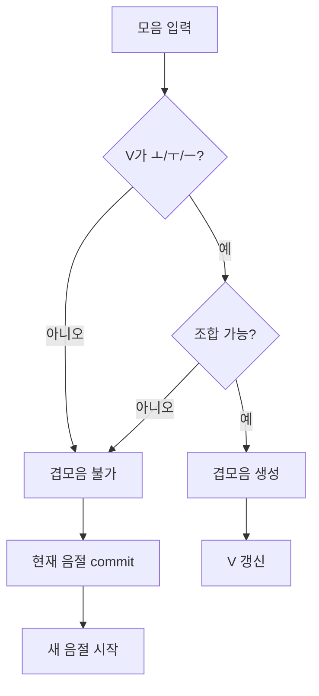
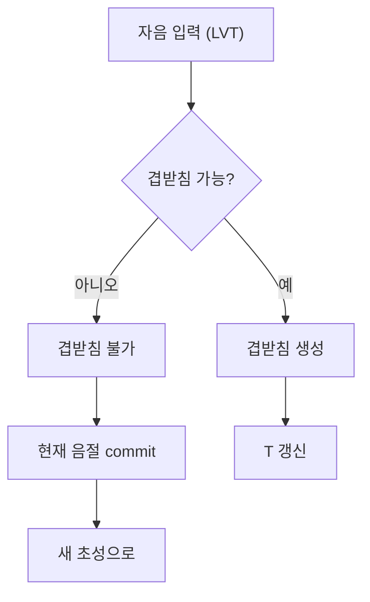
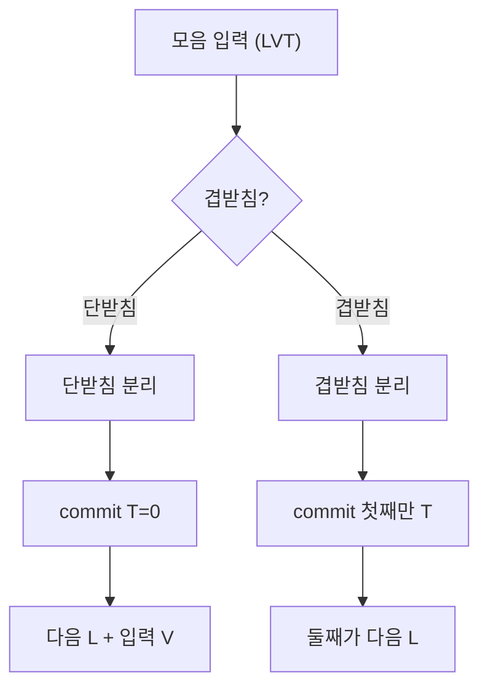

한글 IME에서 **겹모음**(ㅘ, ㅙ, ㅚ, ㅝ, ㅞ, ㅟ, ㅢ), **겹받침**(ㄳ, ㄵ, ㄶ, ㄺ, ㄻ, ㄼ, ㄽ, ㄾ, ㄿ, ㅀ, ㅄ), **종성→다음 글자 초성** 변환을 구현할 때 참고할 **규칙·테이블**을 정리했다. L, V, T 인덱스는 [한글 조합 원리](/korean/combination/)와 동일하다.

---

## 0. 조합 결정 흐름 개요

### 겹모음 결정

### 겹받침 결정

### 종성 분리 (모음 입력 시)

---

## 1. 겹모음 (이중모음) 조합

**단모음** ㅗ(V=8), ㅜ(V=13), ㅡ(V=18) 뒤에 **두 번째 모음**을 넣으면 **겹모음**으로 인식한다. (V 인덱스 0~20 기준.)

### 1.1 첫 모음 + 두 번째 모음 → 겹모음 V

| 첫 모음 (V) | 두 번째 키(모음) | 결과 겹모음 | V 인덱스 |
|-------------|------------------|-------------|----------|
| ㅗ (8) | ㅏ | ㅘ | 9 |
| ㅗ (8) | ㅐ | ㅙ | 10 |
| ㅗ (8) | ㅣ | ㅚ | 11 |
| ㅜ (13) | ㅓ | ㅝ | 14 |
| ㅜ (13) | ㅔ | ㅞ | 15 |
| ㅜ (13) | ㅣ | ㅟ | 16 |
| ㅡ (18) | ㅣ | ㅢ | 19 |

### 1.2 구현 시

- **현재 상태가 "초성+중성"이고 V가 8, 13, 18 중 하나**일 때, 다음에 **모음 키**가 오면 **겹모음 조합**을 시도한다. 위 표에 (현재 V, 입력 모음) → 새 V가 있으면 V를 갱신하고 preedit을 갱신한다.
- **위 표에 없는 조합**(예: ㅏ 뒤에 ㅗ)이면 **현재 음절 commit + 새 (L,V)** 로 처리한다. 이때 **종성→초성** 변환으로 새 L을 정한다(받침 없으면 L=11 ㅇ 등).

---

## 2. 겹받침 (쌍받침)

**종성(T)** 은 28가지(0=없음, 1~27=자모)다. 이 중 **겹받침**은 **두 자음이 합쳐진** 형태로, 유니코드 **종성 블록**(U+11A8~U+11C2)에서 **별도 코드 포인트**를 가진다.

### 2.1 겹받침 종성 인덱스 (T)

| T | 코드 포인트 | 자모 | 설명 |
|---|-------------|------|------|
| 3 | U+11AA | ᆪ (ㄳ) | Kiyeok-Sios |
| 5 | U+11AC | ᆬ (ㄵ) | Nieun-Cieuc |
| 6 | U+11AD | ᆭ (ㄶ) | Nieun-Hieuh |
| 9 | U+11B0 | ᆰ (ㄺ) | Rieul-Kiyeok |
| 10 | U+11B1 | ᆱ (ㄻ) | Rieul-Mieum |
| 11 | U+11B2 | ᆲ (ㄼ) | Rieul-Pieup |
| 12 | U+11B3 | ᆳ (ㄽ) | Rieul-Sios |
| 13 | U+11B4 | ᆴ (ㄾ) | Rieul-Thieuth |
| 14 | U+11B5 | ᆵ (ㄿ) | Rieul-Phieuph |
| 15 | U+11B6 | ᆶ (ㄿ) | Rieul-Hieuh |
| 18 | U+11B9 | ᆹ (ㅄ) | Pieup-Sios |

단받침은 **초성과 같은 키**의 종성 인덱스(T=1,2,4,7,8,…)로 매핑된다. 2벌식에서는 **같은 자음 키를 "종성으로" 눌렀을 때** 먼저 **단받침 T**를 시도하고, **같은 키를 한 번 더** 누르거나 **겹받침 조합**이 되면 위 T로 전이하는 방식이 있다(구현에 따라 다름).

### 2.2 겹받침 입력 규칙 (2벌식)

2벌식에서 **초성+중성** 상태에서 **자음 키 2개**를 연속 입력하면 **첫 번째 = 종성 1, 두 번째 = 종성 2**로 해석해 **겹받침**으로 합친다. 단, **유효한 겹받침**만 허용한다(ㄳ, ㄵ, ㄶ, ㄺ, ㄻ, ㄼ, ㄽ, ㄾ, ㄿ, ㅀ, ㅄ).

- 예: "ㄱ" + "ㅅ" → T=3(ㄳ). "ㄴ" + "ㅈ" → T=5(ㄵ).
- **유효하지 않은** 자음 조합(예: ㄱ+ㄴ)이면 **첫 자음만 종성**으로 두고, **두 번째 자음**은 **다음 음절 초성**으로 처리(commit 후 새 L)하는 방식이 많다.

---

## 3. 종성(T) → 다음 글자 초성(L) 변환

"초성+중성+종성" 상태에서 **모음**을 입력하면, 현재 음절을 **commit**한 뒤 **다음 음절**을 시작한다. 이때 **종성 T**를 **다음 음절의 초성 L**으로 바꿔야 한다.

### 3.1 단받침: T → L (같은 키)

대부분 **단받침 T**는 **같은 키의 초성 L**과 1:1 또는 규칙으로 대응한다.

| T (종성) | 다음 L (초성) | 비고 |
|----------|---------------|------|
| 1 ㄱ | 0 ㄱ | |
| 2 ㄲ | 1 ㄲ | |
| 4 ㄴ | 2 ㄴ | |
| 7 ㄷ | 3 ㄷ | |
| 8 ㄹ | 5 ㄹ | |
| 16 ㅁ | 6 ㅁ | |
| 17 ㅂ | 7 ㅂ | |
| 19 ㅅ | 9 ㅅ | |
| 21 ㅇ | 11 ㅇ | |
| 22 ㅈ | 12 ㅈ | |
| 23 ㅊ | 14 ㅊ | |
| 24 ㅋ | 15 ㅋ | |
| 25 ㅌ | 16 ㅌ | |
| 26 ㅍ | 17 ㅍ | |
| 27 ㅎ | 18 ㅎ | |

T=3,5,6,9~15,18(겹받침)은 **두 글자**로 나뉘어 다음 초성으로 쓸 수 있다. 아래 겹받침 → 다음 L 규칙 참고.

### 3.2 겹받침: T → 다음 L (첫째/둘째 자음)

겹받침은 **첫째 자음**만 다음 초성으로 쓰거나, **둘째 자음**만 쓰거나, **발음 규칙**에 따라 다르게 쓴다. IME에서는 보통 **첫째 자음 = 다음 초성**으로 두는 방식이 많다(예: ㄳ → 다음 ㅅ; ㄺ → 다음 ㄱ 또는 ㄹ; 구현에 따라 다름).

| T (겹받침) | 다음 L (초성) 예 | 비고 |
|------------|------------------|------|
| 3 ㄳ | 9 ㅅ | ㄱ+ㅅ → 다음 ㅅ |
| 5 ㄵ | 12 ㅈ | ㄴ+ㅈ → 다음 ㅈ |
| 6 ㄶ | 18 ㅎ | ㄴ+ㅎ → 다음 ㅎ |
| 9 ㄺ | 0 ㄱ 또는 5 ㄹ | 구현·발음에 따라 |
| 10 ㄻ | 6 ㅁ | |
| 11 ㄼ | 7 ㅂ | |
| 12 ㄽ | 9 ㅅ | |
| 13 ㄾ | 16 ㅌ | |
| 14 ㄿ | 17 ㅍ | |
| 15 ㅀ | 18 ㅎ | |
| 18 ㅄ | 9 ㅅ | ㅂ+ㅅ → 다음 ㅅ |

실제 IME(libhangul 등)는 **종성→초성 변환 테이블**을 소스에 두고, 위 규칙을 테이블로 구현한다. [libhangul](https://github.com/libhangul/libhangul) 소스의 keyboard·combination 관련 코드를 참고하면 된다.

---

## 4. 요약

- **겹모음**: (현재 V=8|13|18) + (입력 모음) → 위 표로 새 V(9~11, 14~16, 19) 결정.
- **겹받침**: 자음 키 2개 시퀀스 → 유효한 T(3,5,6,9~15,18)만 허용.
- **종성→초성**: commit 후 다음 음절 시작 시 T → L 변환표 사용. 단받침은 T→L 1:1, 겹받침은 첫째/둘째 자음 규칙.

[한글 조합 원리](/korean/combination/), [2벌식 알고리즘](/korean/2-set-algorithm/), [한글 입력기 구현](/korean/implementation/)과 함께 참고한다.
