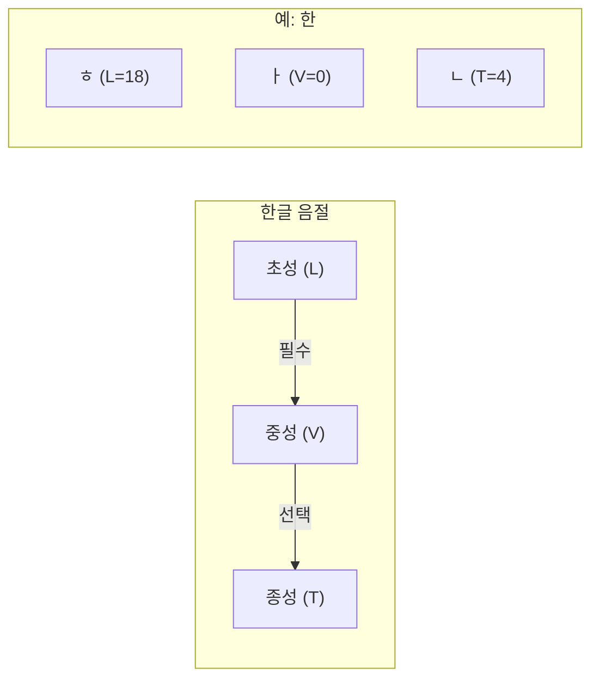
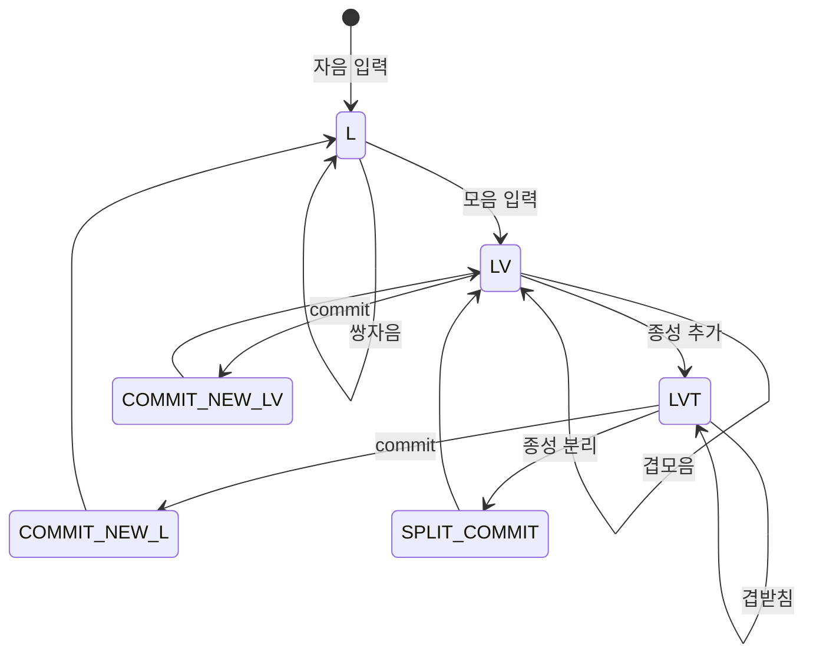

한글은 **초성(첫소리)·중성(가운뎃소리)·종성(끝소리)** 세 부분으로 한 음절을 이룬다. 초성은 자음, 중성은 모음, 종성은 받침(자음 또는 없음)이다. 유니코드에서는 이 조합을 **완성형(Hangul Syllables)** 한 글자로 쓰거나, **조합형(Hangul Jamo)** 자모 시퀀스로 쓴다.

---

## 0. 한글 음절 구조 개요



**음절 조합 공식:**

```
코드 포인트 = 0xAC00 + (L × 588) + (V × 28) + T
```

| 음절 | L | V | T | 계산 | 결과 |
|------|---|---|---|------|------|
| 가 | 0 | 0 | 0 | 0xAC00 + 0 | U+AC00 |
| 나 | 2 | 0 | 0 | 0xAC00 + 1176 | U+B098 |
| 한 | 18 | 0 | 4 | 0xAC00 + 10584 + 4 | U+D55C |
| 글 | 0 | 18 | 8 | 0xAC00 + 504 + 8 | U+AE00 |

---

## 1. 한글의 구성

### 1.1 자모와 음절

- **자모**: 한글의 낱글자. 초성(자음), 중성(모음), 종성(받침)으로 나뉜다.
- **음절**: 초성 + 중성, 또는 초성 + 중성 + 종성이 합쳐진 한 글자. 예: 가, 각, 갈.
- **조합 규칙**: 반드시 **초성 + 중성**이 먼저 오고, 그다음 **종성**이 선택이다. 따라서 “초성만”, “중성만”, “종성만” 단독으로는 한 음절이 되지 않는다.

유니코드 명세(Unicode FAQ - Korean)에 따르면, 한글 음절은 **&lt;LV&gt;** (초성+중성) 또는 **&lt;LVT&gt;** (초성+중성+종성) 시퀀스로 표현된다.

### 1.2 현대 한글에서 쓰는 자모 개수

완성형 한글 음절(U+AC00~U+D7A3)을 만드는 데 쓰는 자모는 다음 **부분집합**이다(Unicode FAQ - Korean 인용).

- **초성(L, Leading consonant)**: **19개** (U+1100~U+1112)
- **중성(V, Vowel)**: **21개** (U+1161~U+1175)
- **종성(T, Trailing consonant)**: **27개** (U+11A8~U+11C2) + **받침 없음** 1가지 → 총 **28가지**

이 19×21×28 조합 중 **11,172개**만 유니코드 완성형 블록에 직접 부여되어 있다.

- **399개** = &lt;LV&gt; (19 × 21): 받침 없는 글자. 예: 가, 나, 다.
- **10,773개** = &lt;LVT&gt; (19 × 21 × 27): 받침 있는 글자. 예: 각, 갈, 감.

---

## 2. 초성(Choseong, L) — 19개

현대 한글 완성형에 쓰이는 초성은 **U+1100~U+1112** 한 블록에 연속 배치되어 있다. 인덱스 0~18과 1:1 대응한다.

| 인덱스 | 코드 포인트 | 자모 | 이름(유니코드) |
|--------|-------------|------|----------------|
| 0 | U+1100 | ᄀ | Hangul Choseong Kiyeok |
| 1 | U+1101 | ᄁ | Hangul Choseong Ssangkiyeok |
| 2 | U+1102 | ᄂ | Hangul Choseong Nieun |
| 3 | U+1103 | ᄃ | Hangul Choseong Tikeut |
| 4 | U+1104 | ᄄ | Hangul Choseong Ssangtikeut |
| 5 | U+1105 | ᄅ | Hangul Choseong Rieul |
| 6 | U+1106 | ᄆ | Hangul Choseong Mieum |
| 7 | U+1107 | ᄇ | Hangul Choseong Pieup |
| 8 | U+1108 | ᄈ | Hangul Choseong Ssangpieup |
| 9 | U+1109 | ᄉ | Hangul Choseong Sios |
| 10 | U+110A | ᄊ | Hangul Choseong Ssangsios |
| 11 | U+110B | ᄋ | Hangul Choseong Ieung |
| 12 | U+110C | ᄌ | Hangul Choseong Cieuc |
| 13 | U+110D | ᄍ | Hangul Choseong Ssangcieuc |
| 14 | U+110E | ᄎ | Hangul Choseong Chieuch |
| 15 | U+110F | ᄏ | Hangul Choseong Khieukh |
| 16 | U+1110 | ᄐ | Hangul Choseong Thieuth |
| 17 | U+1111 | ᄑ | Hangul Choseong Phieuph |
| 18 | U+1112 | ᄒ | Hangul Choseong Hieuh |

U+1113 이후는 **옛초성(Old initial consonants)** 이며, 완성형 11,172자 계산에는 쓰이지 않는다.

---

## 3. 중성(Jungseong, V) — 21개

현대 한글 완성형에 쓰이는 중성은 **U+1161~U+1175**에 연속 배치되어 있다. 인덱스 0~20과 1:1 대응한다.

| 인덱스 | 코드 포인트 | 자모 | 이름(유니코드) |
|--------|-------------|------|----------------|
| 0 | U+1161 | ᅡ | Hangul Jungseong A |
| 1 | U+1162 | ᅢ | Hangul Jungseong Ae |
| 2 | U+1163 | ᅣ | Hangul Jungseong Ya |
| 3 | U+1164 | ᅤ | Hangul Jungseong Yae |
| 4 | U+1165 | ᅥ | Hangul Jungseong Eo |
| 5 | U+1166 | ᅦ | Hangul Jungseong E |
| 6 | U+1167 | ᅧ | Hangul Jungseong Yeo |
| 7 | U+1168 | ᅨ | Hangul Jungseong Ye |
| 8 | U+1169 | ᅩ | Hangul Jungseong O |
| 9 | U+116A | ᅪ | Hangul Jungseong Wa |
| 10 | U+116B | ᅫ | Hangul Jungseong Wae |
| 11 | U+116C | ᅬ | Hangul Jungseong Oe |
| 12 | U+116D | ᅭ | Hangul Jungseong Yo |
| 13 | U+116E | ᅮ | Hangul Jungseong U |
| 14 | U+116F | ᅯ | Hangul Jungseong Weo |
| 15 | U+1170 | ᅰ | Hangul Jungseong We |
| 16 | U+1171 | ᅱ | Hangul Jungseong Wi |
| 17 | U+1172 | ᅲ | Hangul Jungseong Yu |
| 18 | U+1173 | ᅳ | Hangul Jungseong Eu |
| 19 | U+1174 | ᅴ | Hangul Jungseong Yi |
| 20 | U+1175 | ᅵ | Hangul Jungseong I |

U+1160은 **Hangul Jungseong Filler(Vf)** 로, “중성만 단독”일 때 &lt;Lf, V&gt; 형태로 쓸 때 사용한다. U+1176 이후는 옛중성이다.

---

## 4. 종성(Jongseong, T) — 28가지 (27개 자모 + 없음)

종성은 **받침이 있는 경우** 27개 자모(U+11A8~U+11C2), **받침이 없는 경우** 1가지(인덱스 0)로 총 **28가지**다. 완성형 공식에서는 종성 인덱스를 0~27로 두고, 0을 “받침 없음”으로 둔다.

| 인덱스 | 코드 포인트 | 자모 | 이름(유니코드) |
|--------|-------------|------|----------------|
| 0 | (없음) | — | 받침 없음 |
| 1 | U+11A8 | ᆨ | Hangul Jongseong Kiyeok |
| 2 | U+11A9 | ᆩ | Hangul Jongseong Ssangkiyeok |
| 3 | U+11AA | ᆪ | Hangul Jongseong Kiyeok-Sios |
| 4 | U+11AB | ᆫ | Hangul Jongseong Nieun |
| 5 | U+11AC | ᆬ | Hangul Jongseong Nieun-Cieuc |
| 6 | U+11AD | ᆭ | Hangul Jongseong Nieun-Hieuh |
| 7 | U+11AE | ᆮ | Hangul Jongseong Tikeut |
| 8 | U+11AF | ᆯ | Hangul Jongseong Rieul |
| 9 | U+11B0 | ᆰ | Hangul Jongseong Rieul-Kiyeok |
| 10 | U+11B1 | ᆱ | Hangul Jongseong Rieul-Mieum |
| 11 | U+11B2 | ᆲ | Hangul Jongseong Rieul-Pieup |
| 12 | U+11B3 | ᆳ | Hangul Jongseong Rieul-Sios |
| 13 | U+11B4 | ᆴ | Hangul Jongseong Rieul-Thieuth |
| 14 | U+11B5 | ᆵ | Hangul Jongseong Rieul-Phieuph |
| 15 | U+11B6 | ᆶ | Hangul Jongseong Rieul-Hieuh |
| 16 | U+11B7 | ᆷ | Hangul Jongseong Mieum |
| 17 | U+11B8 | ᆸ | Hangul Jongseong Pieup |
| 18 | U+11B9 | ᆹ | Hangul Jongseong Pieup-Sios |
| 19 | U+11BA | ᆺ | Hangul Jongseong Sios |
| 20 | U+11BB | ᆻ | Hangul Jongseong Ssangsios |
| 21 | U+11BC | ᆼ | Hangul Jongseong Ieung |
| 22 | U+11BD | ᆽ | Hangul Jongseong Cieuc |
| 23 | U+11BE | ᆾ | Hangul Jongseong Chieuch |
| 24 | U+11BF | ᆿ | Hangul Jongseong Khieukh |
| 25 | U+11C0 | ᇀ | Hangul Jongseong Thieuth |
| 26 | U+11C1 | ᇁ | Hangul Jongseong Phieuph |
| 27 | U+11C2 | ᇂ | Hangul Jongseong Hieuh |

U+11C3 이후는 옛종성이다. 초성·중성과 달리 **종성 “없음”**이 한 가지 상태이기 때문에, 완성형 인덱스 공식에서 T는 0~27까지 28가지로 둔다.

---

## 5. 조합 규칙 (L, V, T)

### 5.0 상태 전이 (한 음절 조합)

한글 한 음절은 **초성 → 중성 → (종성)** 순서로만 쌓인다.

#### 상태 전이 다이어그램



**상태별 preedit 예시:**
- L: "ㄱ" (초성만)
- LV: "가" (초성+중성)
- LVT: "각" (초성+중성+종성)
- SPLIT_COMMIT: "각" + ㅏ → commit "가" + preedit "가"

#### 각 상태에서의 입력 처리

| 현재 상태 | 입력 | 동작 | 다음 상태 | preedit 변화 |
|-----------|------|------|-----------|-------------|
| 없음 | 자음 | L 설정 | L | "" → "ㄱ" |
| L | 같은 자음 | 쌍자음 | L | "ㄱ" → "ㄲ" |
| L | 다른 자음 | L 교체 | L | "ㄱ" → "ㄴ" |
| L | 모음 | V 설정 | LV | "ㄱ" → "가" |
| LV | 겹모음 가능 모음 | V 갱신 | LV | "고" → "과" |
| LV | 겹모음 불가 모음 | commit, 새 LV | LV | "가" → commit "가", "아" |
| LV | 종성 가능 자음 | T 설정 | LVT | "가" → "각" |
| LV | 종성 불가 자음 | commit, 새 L | L | "가" → commit "가", "ㄸ" |
| LVT | 겹받침 가능 자음 | T 갱신 | LVT | "갈" → "갈ㅁ"(삶) |
| LVT | 겹받침 불가 자음 | commit, 새 L | L | "각" → commit "각", "ㄴ" |
| LVT | 모음 | 분리, commit, 새 LV | LV | "각" → commit "가", "가" |

- **초성만**: L만 있음. preedit에는 "ㄱ"처럼 자모만 보이거나 (L, Vf)로 표시.
- **초성+중성**: (L, V). 완성형 한 글자 계산 가능. preedit에 "가" 표시.
- **초성+중성+종성**: (L, V, T). preedit에 "각" 표시. 다음 자모 입력 시 commit 후 새 상태로 전이.

유니코드에서 한글 자모는 **conjoining(연결)** 방식이다. 즉, L·V·T는 “기준 문자 + 결합 부호”가 아니라, **L–V–T 순서로 나열**하면 한 음절로 해석된다.

- **유효한 음절**: **&lt;L, V&gt;** 또는 **&lt;L, V, T&gt;**.
- **L만 있음**: L 뒤에 V가 오지 않으면 “불완전한 음절”. 표시할 때는 **&lt;L, Vf&gt;** (Vf = U+1160 Hangul Jungseong Filler)로 간주해 렌더링한다(Unicode FAQ).
- **V만 있음**: V 앞에 L이 없으면 **&lt;Lf, V&gt;** (Lf = U+115F Hangul Choseong Filler)로 간주한다.
- **T만 있음**: T 앞에 &lt;L,V&gt;가 없으면 **&lt;Lf, Vf, T&gt;** 로 간주한다.

IME는 사용자가 “ㄱ”만 입력한 상태를 “조합 중”으로 두고, “ㅏ”를 넣으면 “가”로 합친다. 이때 내부적으로는 (L=0, V=0, T=0) → U+AC00으로 변환하는 식으로 동작한다.

**겹모음**(ㅘ, ㅙ, …), **겹받침**(ㄳ, ㄵ, …), **종성→다음 초성** 변환 규칙·테이블은 [한글 조합 규칙(겹모음·겹받침)](/korean/combination-rules/)를 참고한다. 2벌식·3벌식 키 매핑·상태 전이 차이는 [2벌식 알고리즘](/korean/2-set-algorithm/), [3벌식 알고리즘](/korean/3-set-algorithm/)을 참고한다.

---

## 6. 유니코드 블록 정리

| 블록 | 범위 | 개수 | 용도 |
|------|------|------|------|
| **Hangul Syllables (완성형)** | U+AC00~U+D7A3 | 11,172 | L,V,T 인덱스로 계산 가능한 한 음절 한 글자. |
| **Hangul Jamo (조합형 자모)** | U+1100~U+11FF | 초성·중성·종성·옛자모·Filler | L, V, T 시퀀스로 음절 표현. NFD 시 사용. |
| **Hangul Compatibility Jamo (호환 자모)** | U+3131~U+318E | 호환용 | 레거시 코드페이지 호환. 조합형과 1:1 대응 아님. |

- **완성형**: IME가 commit할 때 보통 이 블록의 문자를 쓴다. 한 코드 포인트 = 한 음절.
- **조합형**: 정규화(NFD), 검색, 옛한글 등에서 L·V·T 시퀀스로 쓴다.
- **호환 자모**: KS X 1001 등 레거시 매핑용. 새로 만드는 시스템에서는 완성형 또는 조합형 자모(U+1100~)를 쓰는 것이 좋다.

---

## 7. 완성형 음절 계산 공식

### 7.1 공식

유니코드 명세(Unicode FAQ - Korean, [KL])에 따른 완성형 코드 포인트 계산:

```
S = 0xAC00 + (L × 588) + (V × 28) + T
```

- **L**: 초성 인덱스 (0~18)
- **V**: 중성 인덱스 (0~20)
- **T**: 종성 인덱스 (0~27, 0 = 받침 없음)

### 7.2 계수 588, 28의 의미

- **28** = 종성 경우의 수. 27개 자모 + “받침 없음” 1 = 28.
- **588** = 한 (L, V) 조합당 가질 수 있는 음절 수. 즉 **21(중성) × 28(종성) = 588**.

따라서:

- (L, V) 한 쌍이 고정되면, T만 0~27로 바꿔 28개 음절이 나온다. 예: 가(0,0,0), 각(0,0,1), 갂(0,0,2), …
- L이 0~18, V가 0~20이므로 **19 × 21 = 399** 개의 (L,V) 쌍이 있고, 각각 28개 음절 → 399×28 = 11,172. 그중 T=0인 399개가 LV 음절, T≥1인 399×27 = 10,773개가 LVT 음절이다.

### 7.3 예시

- **가**: L=0, V=0, T=0 → S = 0xAC00 + 0 = U+AC00.
- **각**: L=0, V=0, T=1 → S = 0xAC00 + 28 = U+AC1C.
- **갛**: L=0, V=0, T=27 → S = 0xAC00 + (27×1) = 0xAC1B. (실제 글자는 “갛” U+AC1B.)

### 7.4 역계산 (코드 포인트 → L, V, T)

S = 0xAC00 + (L×588) + (V×28) + T 이므로, S − 0xAC00을 28로 나누면 몫과 나머지로 V, T를 복원하고, 다시 몫을 21로 나누면 L, V를 복원할 수 있다.

```
diff = (S - 0xAC00)
T = diff % 28
diff = diff // 28
V = diff % 21
L = diff // 21
```

---

## 8. Filler (Lf, Vf)와 비완전 음절

- **U+115F** Hangul Choseong Filler (Lf): “초성 없음”을 나타내는 자리 채우기.
- **U+1160** Hangul Jungseong Filler (Vf): “중성 없음”을 나타내는 자리 채우기.

Unicode FAQ에 따르면:

- **L만 있을 때**: 표시는 **&lt;L, Vf&gt;** 로 한다.
- **V만 있을 때**: 표시는 **&lt;Lf, V&gt;** 로 한다.
- **T만 있을 때**: 표시는 **&lt;Lf, Vf, T&gt;** 로 한다.

IME에서 “ㄱ”만 입력한 상태는 아직 음절이 완성되지 않은 “조합 중”이며, 화면에는 보통 “ㄱ”처럼 보이게 하거나, (L,Vf) 시퀀스로 렌더링할 수 있다.

---

## 9. NFD와 NFC

- **NFC(Normalization Form Composed)**: 가능한 &lt;L,V&gt;, &lt;L,V,T&gt; 시퀀스를 **한 코드 포인트** 완성형(U+AC00~U+D7A3)으로 합친다.
- **NFD(Normalization Form Decomposed)**: 완성형 한 글자를 **L, V, T** 조합형 자모(U+1100~) 시퀀스로 풀어 쓴다.

같은 “가”도 NFC면 **U+AC00** 한 코드 포인트, NFD면 **U+1100, U+1161** 두 코드 포인트가 된다. 문자열 비교·검색·저장 시 NFC/NFD 중 하나로 통일해 두는 것이 좋다.

---

## 10. 조합 중 vs 완성과 IME

IME는 사용자 키 입력을 “자모 시퀀스”로 해석하고, (L, V, T) 상태를 유지한다. 그 상태가 **유효한 (L,V) 또는 (L,V,T)** 일 때마다 위 공식으로 완성형 코드 포인트를 계산해, **조합 중 문자열(preedit)** 으로 앱에 넘긴다. 사용자가 스페이스·엔터를 누르거나 다음 자모를 넣어 “이 음절 확정”이 되면, 그때 **commit**으로 문서에 반영한다.

플랫폼·입력기마다 “조합 중에 완성형을 쓸지, 조합형 자모 시퀀스를 쓸지”가 다를 수 있으나, 웹에서는 대부분 **완성형 한 글자**(또는 여러 글자)로 `CompositionEvent.data`에 전달된다.
