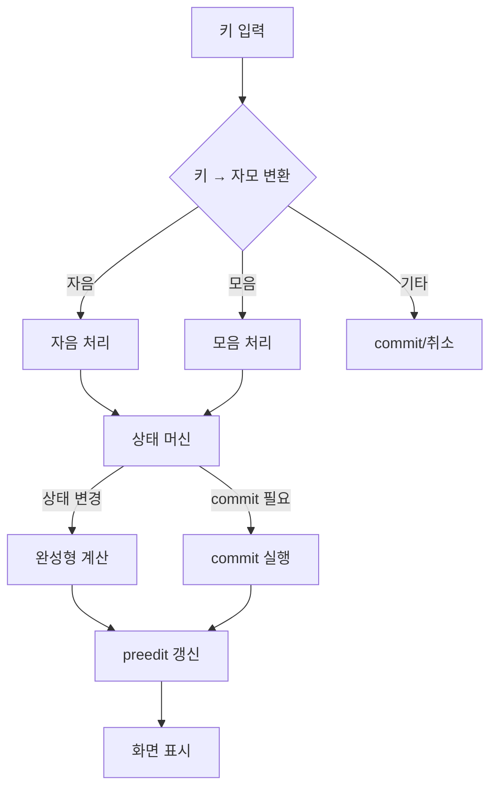
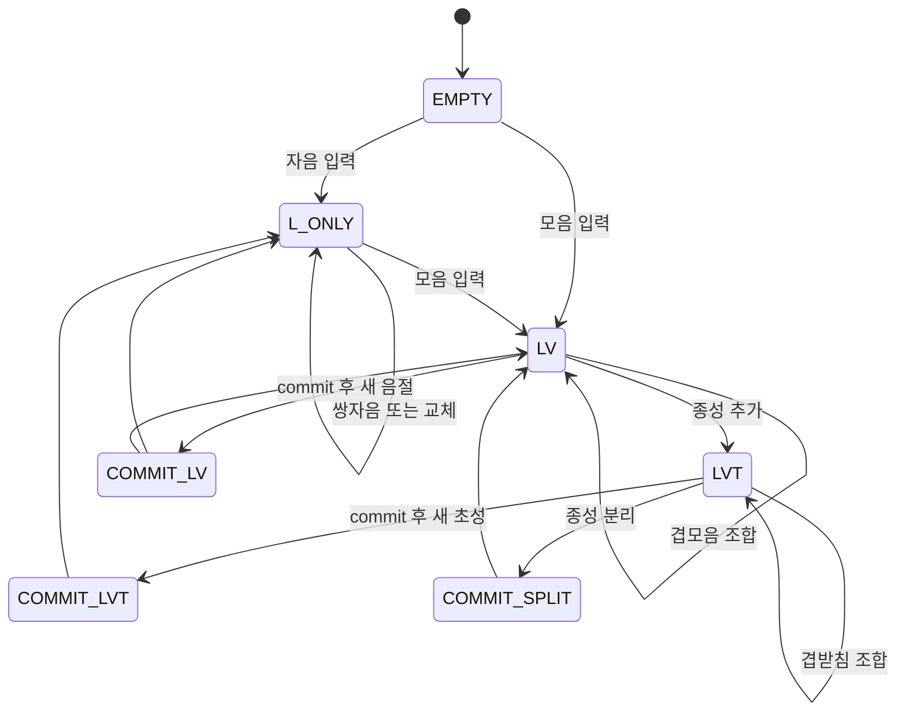
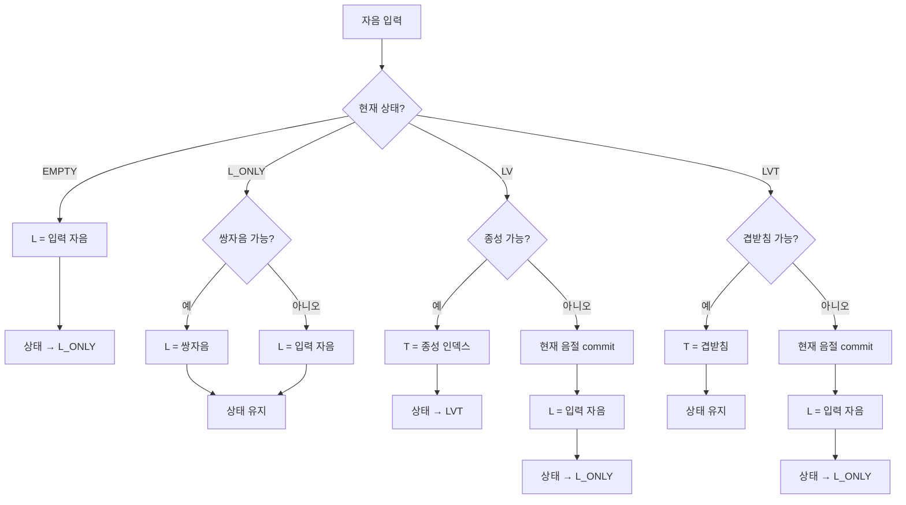
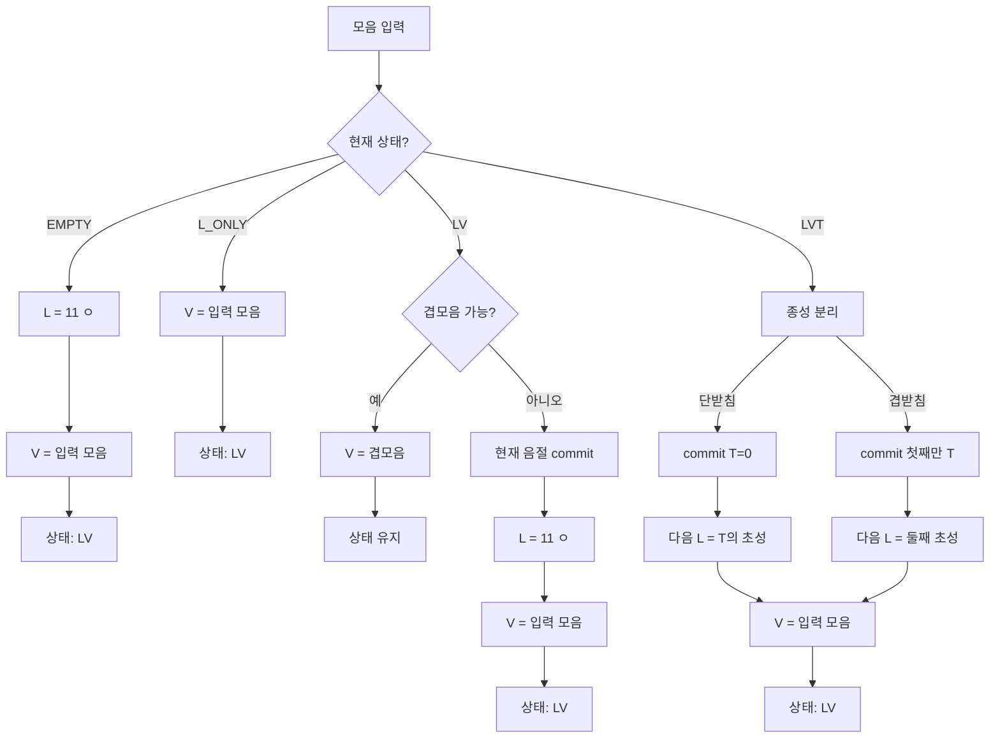
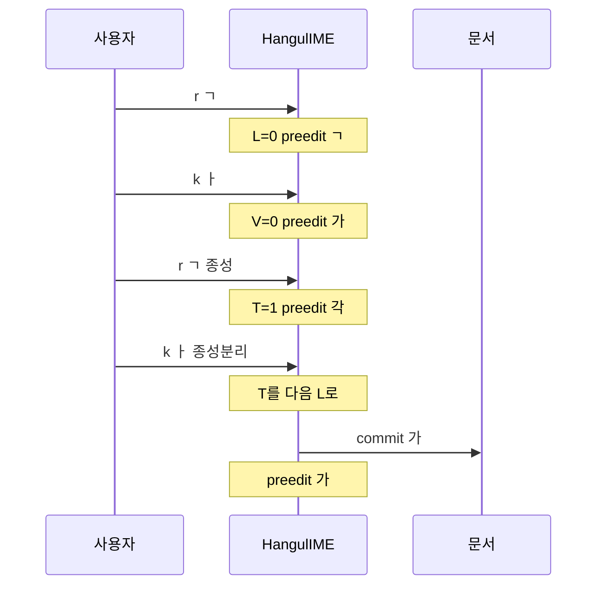
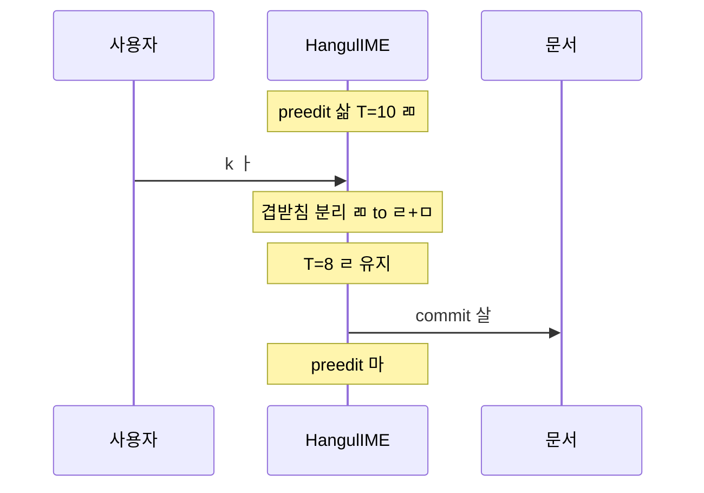

이 문서는 **한글 입력기를 직접 구현**하기 위한 완전한 가이드다. 상태 머신 설계, 키 입력 처리 흐름, 그리고 실제 동작하는 JavaScript 코드를 포함한다.

---

## 1. 구현 개요

한글 입력기는 다음 세 가지를 수행한다:

1. **키 → 자모 변환**: 물리 키를 초성(L)/중성(V)/종성(T) 인덱스로 변환
2. **상태 전이**: 현재 조합 상태에 따라 자모를 해석하고 상태 변경
3. **완성형 계산**: `S = 0xAC00 + (L×588) + (V×28) + T`로 한 글자 생성

---

## 2. 전체 흐름



---

## 3. 상태 머신 상세

### 3.1 상태 정의

| 상태 | 설명 | L | V | T | preedit 예 |
|------|------|---|---|---|-----------|
| EMPTY | 초기 상태 | -1 | -1 | 0 | "" |
| L_ONLY | 초성만 | 0~18 | -1 | 0 | "ㄱ" |
| LV | 초성+중성 | 0~18 | 0~20 | 0 | "가" |
| LVT | 초성+중성+종성 | 0~18 | 0~20 | 1~27 | "각" |

### 3.2 상태 전이 다이어그램



**상태별 preedit:**
- EMPTY: ""
- L_ONLY: "ㄱ" (초성만)
- LV: "가" (초성+중성)
- LVT: "각" (초성+중성+종성)
- COMMIT_SPLIT: "각" + ㅏ → commit "가" + preedit "가"

### 3.3 자음 입력 시 결정 흐름



### 3.4 모음 입력 시 결정 흐름



---

## 4. 완전한 JavaScript 구현

### 4.1 상수 정의

```javascript
// 초성 19개 (L: 0~18)
const CHOSEONG = ['ㄱ','ㄲ','ㄴ','ㄷ','ㄸ','ㄹ','ㅁ','ㅂ','ㅃ','ㅅ','ㅆ','ㅇ','ㅈ','ㅉ','ㅊ','ㅋ','ㅌ','ㅍ','ㅎ'];

// 중성 21개 (V: 0~20)
const JUNGSEONG = ['ㅏ','ㅐ','ㅑ','ㅒ','ㅓ','ㅔ','ㅕ','ㅖ','ㅗ','ㅘ','ㅙ','ㅚ','ㅛ','ㅜ','ㅝ','ㅞ','ㅟ','ㅠ','ㅡ','ㅢ','ㅣ'];

// 종성 28개 (T: 0~27, 0=없음)
const JONGSEONG = ['','ㄱ','ㄲ','ㄳ','ㄴ','ㄵ','ㄶ','ㄷ','ㄹ','ㄺ','ㄻ','ㄼ','ㄽ','ㄾ','ㄿ','ㅀ','ㅁ','ㅂ','ㅄ','ㅅ','ㅆ','ㅇ','ㅈ','ㅊ','ㅋ','ㅌ','ㅍ','ㅎ'];

const HANGUL_BASE = 0xAC00;
const JUNGSEONG_COUNT = 21;
const JONGSEONG_COUNT = 28;
```

### 4.2 키 → 자모 매핑 (2벌식)

```javascript
// 키 → 초성 인덱스
const KEY_TO_CHOSEONG = {
  'r': 0,  'R': 1,   // ㄱ, ㄲ
  's': 2,            // ㄴ
  'e': 3,  'E': 4,   // ㄷ, ㄸ
  'f': 5,            // ㄹ
  'a': 6,            // ㅁ
  'q': 7,  'Q': 8,   // ㅂ, ㅃ
  't': 9,  'T': 10,  // ㅅ, ㅆ
  'd': 11,           // ㅇ
  'w': 12, 'W': 13,  // ㅈ, ㅉ
  'c': 14,           // ㅊ
  'z': 15,           // ㅋ
  'x': 16,           // ㅌ
  'v': 17,           // ㅍ
  'g': 18,           // ㅎ
};

// 키 → 중성 인덱스
const KEY_TO_JUNGSEONG = {
  'k': 0,  'o': 1,   // ㅏ, ㅐ
  'i': 2,  'O': 3,   // ㅑ, ㅒ
  'j': 4,  'p': 5,   // ㅓ, ㅔ
  'u': 6,  'P': 7,   // ㅕ, ㅖ
  'h': 8,            // ㅗ
  'y': 12,           // ㅛ
  'n': 13,           // ㅜ
  'b': 17,           // ㅠ
  'm': 18,           // ㅡ
  'l': 20,           // ㅣ
};

// 초성 인덱스 → 종성 인덱스 (받침 가능한 것만)
const CHOSEONG_TO_JONGSEONG = {
  0: 1,   // ㄱ → T=1
  1: 2,   // ㄲ → T=2
  2: 4,   // ㄴ → T=4
  3: 7,   // ㄷ → T=7
  5: 8,   // ㄹ → T=8
  6: 16,  // ㅁ → T=16
  7: 17,  // ㅂ → T=17
  9: 19,  // ㅅ → T=19
  10: 20, // ㅆ → T=20
  11: 21, // ㅇ → T=21
  12: 22, // ㅈ → T=22
  14: 23, // ㅊ → T=23
  15: 24, // ㅋ → T=24
  16: 25, // ㅌ → T=25
  17: 26, // ㅍ → T=26
  18: 27, // ㅎ → T=27
};

// 종성 인덱스 → 초성 인덱스 (다음 글자 초성으로)
const JONGSEONG_TO_CHOSEONG = {
  1: 0,   // ㄱ
  2: 1,   // ㄲ
  4: 2,   // ㄴ
  7: 3,   // ㄷ
  8: 5,   // ㄹ
  16: 6,  // ㅁ
  17: 7,  // ㅂ
  19: 9,  // ㅅ
  20: 10, // ㅆ
  21: 11, // ㅇ
  22: 12, // ㅈ
  23: 14, // ㅊ
  24: 15, // ㅋ
  25: 16, // ㅌ
  26: 17, // ㅍ
  27: 18, // ㅎ
};
```

### 4.3 겹모음/겹받침 조합 테이블

```javascript
// 겹모음: [현재 V, 입력 V] → 결과 V
const DOUBLE_JUNGSEONG = {
  '8,0': 9,    // ㅗ + ㅏ → ㅘ
  '8,1': 10,   // ㅗ + ㅐ → ㅙ
  '8,20': 11,  // ㅗ + ㅣ → ㅚ
  '13,4': 14,  // ㅜ + ㅓ → ㅝ
  '13,5': 15,  // ㅜ + ㅔ → ㅞ
  '13,20': 16, // ㅜ + ㅣ → ㅟ
  '18,20': 19, // ㅡ + ㅣ → ㅢ
};

// 겹받침: [현재 T, 입력 L] → 결과 T
const DOUBLE_JONGSEONG = {
  '1,9': 3,    // ㄱ + ㅅ → ㄳ
  '4,12': 5,   // ㄴ + ㅈ → ㄵ
  '4,18': 6,   // ㄴ + ㅎ → ㄶ
  '8,0': 9,    // ㄹ + ㄱ → ㄺ
  '8,6': 10,   // ㄹ + ㅁ → ㄻ
  '8,7': 11,   // ㄹ + ㅂ → ㄼ
  '8,9': 12,   // ㄹ + ㅅ → ㄽ
  '8,16': 13,  // ㄹ + ㅌ → ㄾ
  '8,17': 14,  // ㄹ + ㅍ → ㄿ
  '8,18': 15,  // ㄹ + ㅎ → ㅀ
  '17,9': 18,  // ㅂ + ㅅ → ㅄ
};

// 겹받침 분리: T → [남는 T, 다음 L]
const SPLIT_JONGSEONG = {
  3: [1, 9],    // ㄳ → ㄱ + ㅅ
  5: [4, 12],   // ㄵ → ㄴ + ㅈ
  6: [4, 18],   // ㄶ → ㄴ + ㅎ
  9: [8, 0],    // ㄺ → ㄹ + ㄱ
  10: [8, 6],   // ㄻ → ㄹ + ㅁ
  11: [8, 7],   // ㄼ → ㄹ + ㅂ
  12: [8, 9],   // ㄽ → ㄹ + ㅅ
  13: [8, 16],  // ㄾ → ㄹ + ㅌ
  14: [8, 17],  // ㄿ → ㄹ + ㅍ
  15: [8, 18],  // ㅀ → ㄹ + ㅎ
  18: [17, 9],  // ㅄ → ㅂ + ㅅ
};
```

### 4.4 HangulIME 클래스

```javascript
class HangulIME {
  constructor() {
    this.L = -1;  // 초성 인덱스 (-1 = 없음)
    this.V = -1;  // 중성 인덱스 (-1 = 없음)
    this.T = 0;   // 종성 인덱스 (0 = 없음)
    this.commitBuffer = '';
  }

  // 완성형 한 글자 계산
  getSyllable() {
    if (this.L < 0 || this.V < 0) return '';
    const code = HANGUL_BASE + 
                 (this.L * JUNGSEONG_COUNT * JONGSEONG_COUNT) + 
                 (this.V * JONGSEONG_COUNT) + 
                 this.T;
    return String.fromCodePoint(code);
  }

  // 현재 preedit 문자열
  getPreedit() {
    if (this.L < 0) return '';
    if (this.V < 0) return CHOSEONG[this.L];
    return this.getSyllable();
  }

  // commit 버퍼 비우고 반환
  flushCommit() {
    const result = this.commitBuffer;
    this.commitBuffer = '';
    return result;
  }

  // 상태 초기화
  reset() {
    this.L = -1;
    this.V = -1;
    this.T = 0;
  }

  // 현재 음절을 commit 버퍼에 추가
  commitCurrent() {
    const syllable = this.getSyllable();
    if (syllable) {
      this.commitBuffer += syllable;
    }
    this.reset();
  }

  // 키 입력 처리 (메인 로직)
  process(key) {
    // 자음 키인가?
    if (key in KEY_TO_CHOSEONG) {
      return this.processConsonant(KEY_TO_CHOSEONG[key]);
    }
    
    // 모음 키인가?
    if (key in KEY_TO_JUNGSEONG) {
      return this.processVowel(KEY_TO_JUNGSEONG[key]);
    }
    
    // 기타 키 (스페이스, 엔터 등)
    this.commitCurrent();
    return { commit: this.flushCommit(), preedit: '' };
  }

  // 자음 처리
  processConsonant(choseong) {
    // 상태 1: 비어있음 → L 설정
    if (this.L < 0) {
      this.L = choseong;
      return { commit: this.flushCommit(), preedit: this.getPreedit() };
    }

    // 상태 2: 초성만 있음 → 쌍자음 시도 또는 교체
    if (this.V < 0) {
      // 쌍자음 시도 (같은 자음 두 번)
      if (this.L === choseong) {
        const doubled = this.tryDoubleChoseong(choseong);
        if (doubled !== null) {
          this.L = doubled;
          return { commit: this.flushCommit(), preedit: this.getPreedit() };
        }
      }
      // 다른 자음이면 교체
      this.L = choseong;
      return { commit: this.flushCommit(), preedit: this.getPreedit() };
    }

    // 상태 3: 초성+중성 있음 → 종성 시도
    if (this.T === 0) {
      const jongseong = CHOSEONG_TO_JONGSEONG[choseong];
      if (jongseong !== undefined) {
        this.T = jongseong;
        return { commit: this.flushCommit(), preedit: this.getPreedit() };
      }
      // 종성 불가 → commit 후 새 초성
      this.commitCurrent();
      this.L = choseong;
      return { commit: this.flushCommit(), preedit: this.getPreedit() };
    }

    // 상태 4: 초성+중성+종성 있음 → 겹받침 시도
    const doubleJong = DOUBLE_JONGSEONG[`${this.T},${choseong}`];
    if (doubleJong !== undefined) {
      this.T = doubleJong;
      return { commit: this.flushCommit(), preedit: this.getPreedit() };
    }

    // 겹받침 불가 → commit 후 새 초성
    this.commitCurrent();
    this.L = choseong;
    return { commit: this.flushCommit(), preedit: this.getPreedit() };
  }

  // 모음 처리
  processVowel(jungseong) {
    // 상태 1: 비어있음 → ㅇ + 모음
    if (this.L < 0) {
      this.L = 11; // ㅇ
      this.V = jungseong;
      return { commit: this.flushCommit(), preedit: this.getPreedit() };
    }

    // 상태 2: 초성만 있음 → 중성 추가
    if (this.V < 0) {
      this.V = jungseong;
      return { commit: this.flushCommit(), preedit: this.getPreedit() };
    }

    // 상태 3: 초성+중성 있음 → 겹모음 시도
    if (this.T === 0) {
      const doubleJung = DOUBLE_JUNGSEONG[`${this.V},${jungseong}`];
      if (doubleJung !== undefined) {
        this.V = doubleJung;
        return { commit: this.flushCommit(), preedit: this.getPreedit() };
      }
      // 겹모음 불가 → commit 후 새 (ㅇ, V)
      this.commitCurrent();
      this.L = 11; // ㅇ
      this.V = jungseong;
      return { commit: this.flushCommit(), preedit: this.getPreedit() };
    }

    // 상태 4: 초성+중성+종성 있음 → 종성 분리
    const split = SPLIT_JONGSEONG[this.T];
    if (split) {
      // 겹받침 분리
      const [remainT, nextL] = split;
      this.T = remainT;
      this.commitCurrent();
      this.L = nextL;
      this.V = jungseong;
    } else {
      // 단받침 → 다음 초성으로
      const nextL = JONGSEONG_TO_CHOSEONG[this.T];
      this.T = 0;
      this.commitCurrent();
      this.L = nextL;
      this.V = jungseong;
    }
    return { commit: this.flushCommit(), preedit: this.getPreedit() };
  }

  // 쌍자음 변환 시도
  tryDoubleChoseong(choseong) {
    const doubles = { 0: 1, 3: 4, 7: 8, 9: 10, 12: 13 };
    return doubles[choseong] ?? null;
  }

  // 취소 (Esc)
  cancel() {
    this.reset();
    return { commit: '', preedit: '' };
  }

  // 강제 확정
  flush() {
    this.commitCurrent();
    return { commit: this.flushCommit(), preedit: '' };
  }
}
```

### 4.5 사용 예시

```javascript
const ime = new HangulIME();

// "가나다" 입력 시뮬레이션
const inputs = ['r', 'k', 's', 'k', 'e', 'k', ' '];
let document = '';

for (const key of inputs) {
  const result = ime.process(key);
  document += result.commit;
  console.log(`키: ${key}, commit: "${result.commit}", preedit: "${result.preedit}"`);
}

console.log(`최종 문서: "${document}"`);
// 출력:
// 키: r, commit: "", preedit: "ㄱ"
// 키: k, commit: "", preedit: "가"
// 키: s, commit: "가", preedit: "ㄴ"
// 키: k, commit: "", preedit: "나"
// 키: e, commit: "나", preedit: "ㄷ"
// 키: k, commit: "", preedit: "다"
// 키:  , commit: "다", preedit: ""
// 최종 문서: "가나다"
```

---

## 5. 종성 분리 상세

모음 입력 시 종성이 다음 음절의 초성으로 이동하는 과정:



---

## 6. 겹받침 분리 예시

"삶" + ㅏ → "살" + "마" 입력 과정:



---

## 7. 에디터 통합

```javascript
class HangulEditor {
  constructor(element) {
    this.el = element;
    this.ime = new HangulIME();
    this.content = '';
    
    this.el.addEventListener('keydown', this.onKeyDown.bind(this));
  }

  onKeyDown(e) {
    // 한글 키가 아니면 IME 확정
    if (!this.isHangulKey(e.key)) {
      const result = this.ime.flush();
      this.content += result.commit;
      this.render();
      return; // 기본 동작 허용
    }

    e.preventDefault();
    
    const result = this.ime.process(e.key);
    this.content += result.commit;
    this.render(result.preedit);
  }

  isHangulKey(key) {
    return key in KEY_TO_CHOSEONG || key in KEY_TO_JUNGSEONG;
  }

  render(preedit = '') {
    // content + preedit(밑줄) 표시
    this.el.textContent = this.content + preedit;
  }
}
```

---

## 8. 참고 문서

- [한글 조합 원리](/korean/combination/) - L/V/T 인덱스, 완성형 공식
- [한글 조합 규칙](/korean/combination-rules/) - 겹모음, 겹받침 테이블
- [2벌식 알고리즘](/korean/2-set-algorithm/) - KS X 5002 키 매핑
- [3벌식 알고리즘](/korean/3-set-algorithm/) - 세벌식 키 매핑
- [libhangul API](/korean/libhangul-api/) - C 라이브러리 사용법
