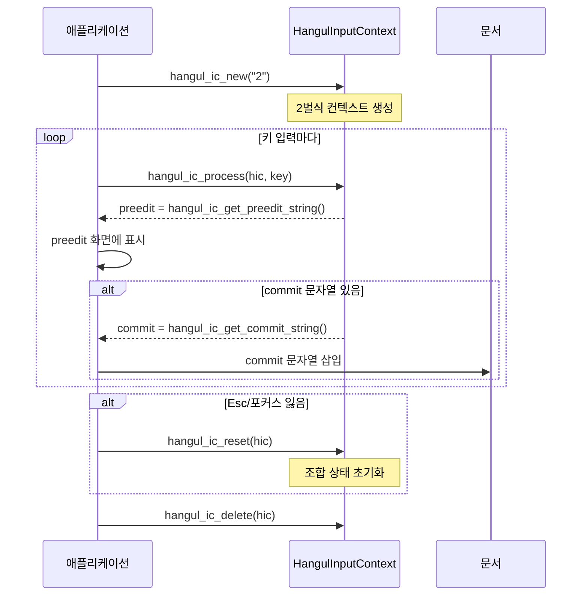

**libhangul**은 한글 조합 알고리즘(2벌·3벌)과 한자 검색을 제공하는 C 라이브러리(LGPL-2.1)이다. Linux 한글 입력기(ibus-hangul, fcitx-hangul, nabi), macOS 구름(Gureum) 등이 이 라이브러리를 사용한다. 아래는 `hangul.h` 기준 주요 API 요약이다. 실제 사용 시 [libhangul](https://github.com/libhangul/libhangul) 소스와 [libhangul-doc](https://github.com/libhangul/libhangul-doc)을 참고한다.

---

## 1. 한글 자모·음절 판별 (hangulctype)

| 함수 | 설명 |
|------|------|
| **hangul_is_choseong(ucschar c)** | 초성 자모 여부 |
| **hangul_is_jungseong(ucschar c)** | 중성 자모 여부 |
| **hangul_is_jongseong(ucschar c)** | 종성 자모 여부 |
| **hangul_is_syllable(ucschar c)** | 완성형 한글 음절(U+AC00~D7A3) 여부 |
| **hangul_is_jamo(ucschar c)** | 자모(호환·조합형 포함) 여부 |
| **hangul_jamo_to_syllable(choseong, jungseong, jongseong)** | 초·중·종성 → 완성형 음절 코드 포인트 |
| **hangul_syllable_to_jamo(syllable, *choseong, *jungseong, *jongseong)** | 완성형 음절 → 초·중·종성 자모 |
| **hangul_syllable_iterator_prev / _next** | 문자열 안에서 음절 단위로 이전/다음 위치 |
| **hangul_syllable_len** | 문자열에서 음절 개수(또는 길이) |

`ucschar` 는 `uint32_t` (유니코드 코드 포인트). 초성·중성·종성은 유니코드 한글 자모 블록(U+1100~) 또는 호환 자모(U+3130~)를 사용한다.

---

## 2. 키보드 (HangulKeyboard)

| 함수 | 설명 |
|------|------|
| **hangul_keyboard_new()** | 빈 키보드 생성 |
| **hangul_keyboard_new_from_file(path)** | 파일에서 키보드 정의 로드 |
| **hangul_keyboard_delete(keyboard)** | 키보드 해제 |
| **hangul_keyboard_set_type(keyboard, type)** | 타입 설정 (JAMO, JASO, ROMAJA 등) |
| **hangul_keyboard_list_get_count()** | 내장 키보드 개수 |
| **hangul_keyboard_list_get_keyboard_id(index)** | 키보드 ID (예: "2" = 2벌식, "3" = 3벌식) |
| **hangul_keyboard_list_get_keyboard(id)** | ID로 키보드 객체 얻기 |

타입 상수: `HANGUL_KEYBOARD_TYPE_JAMO`, `HANGUL_KEYBOARD_TYPE_JASO`, `HANGUL_KEYBOARD_TYPE_ROMAJA` 등.

---

## 3. 입력 컨텍스트 (HangulInputContext)

### 3.1 생성·해제

```c
HangulInputContext* hangul_ic_new(const char* keyboard_id);  /* 예: "2", "3" */
void                hangul_ic_delete(HangulInputContext* hic);
```

`keyboard_id` 는 **hangul_keyboard_list_get_keyboard_id** 로 얻은 문자열(예: "2" = 2벌식).

### 3.2 키 입력 처리

| 함수 | 설명 |
|------|------|
| **hangul_ic_process(hic, ascii)** | 키 하나 처리. `ascii` = 키 코드 또는 문자. 내부 (L,V,T) 상태 갱신. 반환값은 처리 성공 여부 등. |
| **hangul_ic_reset(hic)** | 조합 상태·commit 버퍼 초기화. Esc·포커스 잃음 시 호출. |
| **hangul_ic_backspace(hic)** | 조합 중 한 단계 취소(백스페이스). |

### 3.3 preedit·commit 문자열

| 함수 | 설명 |
|------|------|
| **hangul_ic_get_preedit_string(hic)** | 현재 조합 중인 문자열(ucschar*). 완성형 한 글자 또는 자모. |
| **hangul_ic_get_commit_string(hic)** | 이번 **process** 호출로 확정된 문자열. 있으면 앱이 문서에 반영한 뒤, 다음 process 전에 **hangul_ic_reset** 으로 비울 수 있음. |
| **hangul_ic_flush(hic)** | 현재 조합 중인 내용을 commit 문자열로 넘기고, 조합 상태 초기화. |

### 3.4 상태 조회

| 함수 | 설명 |
|------|------|
| **hangul_ic_is_empty(hic)** | 조합 상태가 비었는지 |
| **hangul_ic_has_choseong(hic)** | 초성이 있는지 |
| **hangul_ic_has_jungseong(hic)** | 중성이 있는지 |
| **hangul_ic_has_jongseong(hic)** | 종성이 있는지 |
| **hangul_ic_is_transliteration(hic)** | 로마자 변환 등 특수 모드 여부 |

### 3.5 옵션·출력 모드

| 함수 | 설명 |
|------|------|
| **hangul_ic_set_option(hic, option, value)** | 옵션 설정. 예: `HANGUL_IC_OPTION_AUTO_REORDER`, `HANGUL_IC_OPTION_COMBI_ON_DOUBLE_STROKE`. |
| **hangul_ic_set_output_mode(hic, mode)** | 출력 모드. `HANGUL_OUTPUT_SYLLABLE` (완성형), `HANGUL_OUTPUT_JAMO` (자모). |
| **hangul_ic_set_keyboard(hic, keyboard)** | 런타임에 키보드 전환. |
| **hangul_ic_select_keyboard(hic, id)** | 키보드 ID로 전환. |
| **hangul_ic_connect_callback(hic, event, callback, user_data)** | 이벤트 콜백(commit 등) 연결. |

---

## 4. 한자 (HanjaTable, HanjaList)

한글 읽기로 한자 후보를 검색할 때 사용한다.

| 함수 | 설명 |
|------|------|
| **hanja_table_load(filename)** | 한자 사전 파일 로드. |
| **hanja_table_match_exact(table, key)** | 읽기가 key와 완전 일치하는 항목 |
| **hanja_table_match_prefix(table, key)** | 접두어 일치 (예: "한" → "한글", "한자" 등) |
| **hanja_table_match_suffix(table, key)** | 접미어 일치 |
| **hanja_table_delete(table)** | 테이블 해제 |
| **hanja_list_get_size(list)** | 후보 개수 |
| **hanja_list_get_nth_key(list, n)** | n번째 항목의 읽기(키) |
| **hanja_list_get_nth_value(list, n)** | n번째 항목의 한자(값) |
| **hanja_list_get_nth_comment(list, n)** | n번째 항목의 주석(있는 경우) |
| **hanja_list_delete(list)** | 리스트 해제 |

---

## 5. 조합 (HangulCombination)

**hangul_ic_set_combination** 은 deprecated. 사용자 정의 조합 규칙은 **HangulCombination** 과 **hangul_combination_set_data** 로 설정할 수 있으나, 현재는 **hangul_keyboard_new_from_file** 등으로 키보드 정의에 포함하는 방식을 권장한다.

---

## 6. 사용 흐름

### 6.1 흐름도



### 6.2 코드 예시

```c
#include <hangul/hangul.h>

int main() {
    // 1. 입력 컨텍스트 생성 (2벌식)
    HangulInputContext* hic = hangul_ic_new("2");
    
    // 2. 키 입력 처리 ("가" 입력: r=ㄱ, k=ㅏ)
    hangul_ic_process(hic, 'r');
    printf("preedit: %s\n", hangul_ic_get_preedit_string(hic));  // "ㄱ"
    
    hangul_ic_process(hic, 'k');
    printf("preedit: %s\n", hangul_ic_get_preedit_string(hic));  // "가"
    
    // 3. 다음 글자 입력 시 자동 commit
    hangul_ic_process(hic, 's');  // ㄴ
    const ucschar* commit = hangul_ic_get_commit_string(hic);
    if (commit && commit[0]) {
        printf("commit: %s\n", commit);  // "가"
    }
    printf("preedit: %s\n", hangul_ic_get_preedit_string(hic));  // "ㄴ"
    
    // 4. 강제 commit (flush)
    hangul_ic_flush(hic);
    commit = hangul_ic_get_commit_string(hic);
    if (commit && commit[0]) {
        printf("commit: %s\n", commit);  // "ㄴ" (또는 조합 상태에 따라)
    }
    
    // 5. 정리
    hangul_ic_delete(hic);
    return 0;
}
```

### 6.3 이벤트 콜백 사용

```c
void on_commit(HangulInputContext* hic, const ucschar* str, void* user_data) {
    Document* doc = (Document*)user_data;
    document_insert(doc, str);
}

int main() {
    HangulInputContext* hic = hangul_ic_new("2");
    Document* doc = document_new();
    
    // commit 이벤트에 콜백 연결
    hangul_ic_connect_callback(hic, "commit", on_commit, doc);
    
    // 이제 commit 발생 시 on_commit이 자동 호출됨
    hangul_ic_process(hic, 'r');
    hangul_ic_process(hic, 'k');
    hangul_ic_process(hic, 's');  // "가" commit → on_commit 호출
    
    hangul_ic_delete(hic);
    document_delete(doc);
}

---

## 7. 참고

- [libhangul 저장소](https://github.com/libhangul/libhangul)
- [libhangul-doc](https://github.com/libhangul/libhangul-doc)
- [한글 입력기 구현](/korean/implementation/) (조합 원리·2벌식 매핑)
- [IME·한글 구현 코드 예시](/reference/code-examples/) (C/JavaScript 예시)
